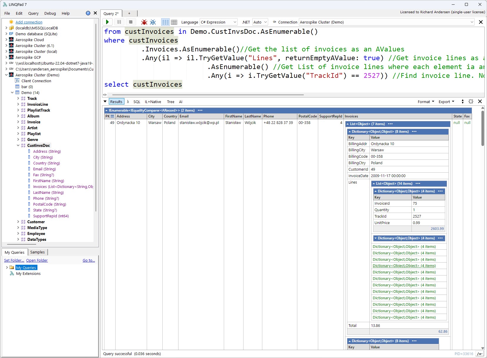
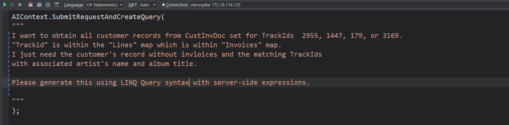
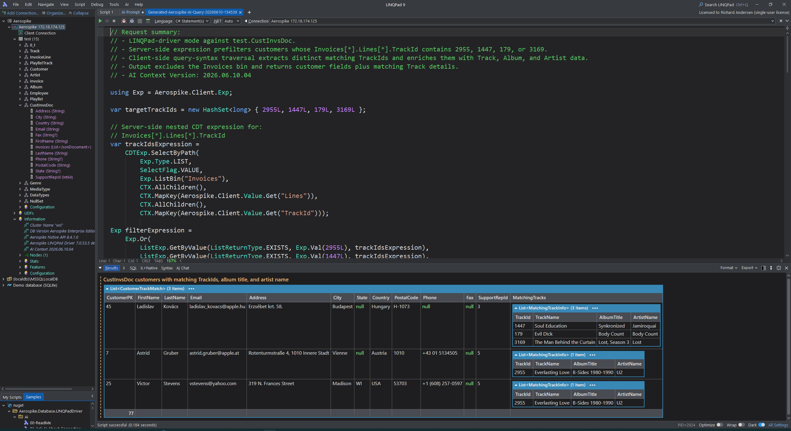
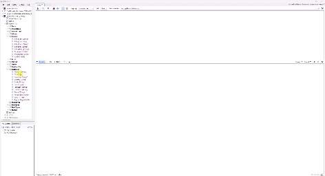

# Aerospike LINQPad Driver

<p align="center">
  
</p>

<p align="center"><strong>The interactive C# workbench for exploring, querying, and managing Aerospike.</strong></p>

<p align="center">
  Connect LINQPad to a live Aerospike cluster, browse its data model, write expressive C# queries with IntelliSense, inspect results immediately, and move to the native Aerospike client whenever you need lower-level control.
</p>

<p align="center">
  <a href="docs/getting-started.md"><strong>Get started</strong></a>
  &nbsp;·&nbsp;
  <a href="linqpad-samples/README.md"><strong>Browse samples</strong></a>
  &nbsp;·&nbsp;
  <a href="docs/ai-features.md"><strong>Explore AI features</strong></a>
  &nbsp;·&nbsp;
  <a href="https://aerospike-community.github.io/aerospike-linqpad-driver/"><strong>API reference</strong></a>
</p>

---

## See your Aerospike cluster as an interactive C# data model

The driver discovers namespaces, sets, sampled bins, secondary indexes, UDFs, and cluster metadata, then presents them in LINQPad's connection explorer. Drag a generated object into a query, discover available members through IntelliSense, and inspect records without building a separate application first.

<p align="center">
  
</p>

**What this gives you**

- A browsable view of cluster, namespace, set, bin, index, and UDF information.
- Generated C# properties for observed bins.
- Fast, interactive feedback while developing queries or investigating data.
- Connection-aware helpers directly inside the LINQPad query experience.

## Query Aerospike using familiar C# and LINQ

Use LINQ query syntax or method syntax to filter, project, sort, group, and join records. Results render through LINQPad's rich object viewer, making exploratory work easy to read and refine.

```csharp
var customers =
    from customer in test.Customer.AsEnumerable()
    where customer.State == "CA"
    orderby customer.LastName, customer.FirstName
    select new
    {
        customer.PK,
        customer.FirstName,
        customer.LastName,
        customer.Email
    };

customers.Take(100).Dump();
```

<p align="center">
  
</p>

The driver supports several deliberate execution paths:

- **Primary-key reads** for direct record access.
- **Secondary-index queries** for indexed lookups.
- **Server-side Aerospike expressions** to reduce data returned to the client.
- **Client-side LINQ** for flexible interactive exploration.
- **Native C# client access** when the driver abstraction is not the right tool.

## Work naturally with schemaless and mixed-type data

Aerospike records do not need a fixed relational schema. The driver's `AValue` and `APrimaryKey` types make that flexibility easier to use from strongly typed C#.

Use them to:

- Detect missing or empty bins safely.
- Compare and convert numeric or textual values.
- Traverse maps, lists, JSON, and document-style structures.
- Handle bins whose observed type varies between records.
- Build expressive predicates without scattering casts and null checks throughout a query.

```csharp
from customer in test.Customer.AsEnumerable()
where !customer.Company.IsEmpty
   && customer.FirstName.TryApply<string, bool>(
       name => name.StartsWith("J", StringComparison.OrdinalIgnoreCase))
select customer
```

[Learn about Auto Values →](docs/auto-values/README.md)

## Turn live connection metadata into better AI-generated code

The driver can build a focused Markdown context for LINQPad AI from the active Aerospike connection. The context can include namespaces, sets, observed bins, indexes, Auto Value rules, syntax preferences, safety guidance, and driver-versus-native code-generation rules.

<p align="center">
  
</p>

Use AI assistance to:

- Generate LINQPad-driver queries in query or method syntax.
- Generate native Aerospike C# client code.
- Create server-side expression filters.
- Explain an existing query.
- Translate a driver query into native-client code.
- Create a new, openable `.linq` file from generated code.

<p align="center">
  
</p>

Generated code remains code: review the selected connection, limits, policies, expressions, and any write behavior before execution.

[See AI-assisted query generation →](docs/ai-features.md)

## Join and reshape data interactively

Aerospike is not a relational database, but LINQPad gives you a productive workspace for client-side joins and projections when that is appropriate for your workload. Explore relationships, validate denormalized models, and turn results into exactly the shape needed for analysis or application code.

<p align="center">
  
</p>

For larger datasets, use bounded reads, primary-key lookups, secondary indexes, and server-side expressions deliberately so the client only receives the data it needs.

## More than a query browser

The driver exposes a broad Aerospike toolbox from the same interactive environment.

| Capability | What you can do |
|---|---|
| **Read and write records** | Get, put, delete, operate, batch, and truncate through driver helpers or the native client. |
| **Map C# objects** | Serialize and deserialize POCOs, use mapping attributes, and work with JSON or document-style data. |
| **Use collection data types** | Inspect and operate on Aerospike maps and lists. |
| **Run UDFs** | Browse available modules and functions, then invoke UDFs from a query. |
| **Use multi-record transactions** | Create, manage, commit, and abort Aerospike MRT workflows. |
| **Import and export data** | Move records through JSON and supported driver import/export helpers. |
| **Generate code** | Produce driver-oriented or native-client C# from records and existing queries. |
| **Inspect metadata** | Review cluster, namespace, set, bin, secondary-index, and UDF details. |

<p align="center">
  
</p>

## Built for practical development and production-aware workflows

- **LINQPad 9+ and .NET 8** support.
- Authentication and TLS connection options.
- Public, alternate, and cloud-oriented address configuration.
- Configurable policies, timeouts, metadata refresh, and sampling.
- A **Production Cluster** safeguard that blocks selected high-risk helpers such as truncate and import.
- Direct access to `AerospikeClient`, policies, expressions, and native APIs.
- Runnable `.linq` samples covering setup, querying, data operations, AI workflows, and advanced scenarios.

## Start exploring

1. [Install the driver and create a connection](docs/getting-started.md).
2. Run [`linqpad-samples/Demo/ReadMeFirst.linq`](linqpad-samples/Demo/ReadMeFirst.linq).
3. Follow the [sample catalog](linqpad-samples/README.md).
4. Use the [documentation index](docs/README.md) to go deeper.

<p align="center"><strong>Bring Aerospike data, C#, LINQ, native client APIs, and AI-assisted development into one interactive workspace.</strong></p>
