# Aerospike Database for LINQPad 7+ (Windows Only) and LINQPad 8+ (Windows and MacOS)

## Description

[Aerospike](https://aerospike.com/) for LINQPad 7/8 is a data context dynamic driver for interactively querying and updating an Aerospike database using "[LINQPad](https://www.linqpad.net/)". LINQPad is a Graphical Development Tool designed for rapid prototyping, interactive testing, data modeling, data mining, drag-and-drop execution, interactive debugging, etc. The Aerospike driver for LINQPad is designed to support all LINQPad capabilities including the enhanced ability to learn and use the [Aerospike API directly](https://developer.aerospike.com/client/csharp).

Here is a subset of what you can perform using the driver:

-   Query any [Aerospike Set or Secondary Index](https://docs.aerospike.com/server/architecture/overview) using any LINQ command (including joins), interactively.
-   Use the driver’s extension methods to perform operations like Aerospike Expression, CRUD operations, etc. without understanding the underlying Aerospike API.
-   Serialize and deserialize any C\# object via the Object-Mapper (POCO). The driver supports all C\# data types, nested classes, and collections.
-   Full JSON support using [Json.NET](https://www.newtonsoft.com/json).
-   Be able to execute [UDF](https://aerospike.com/docs/database/advanced/udf/)s directly and display their underlying code. UDFs are treated like C\# methods with [IntelliSense](https://learn.microsoft.com/en-us/visualstudio/ide/using-intellisense?view=vs-2022) and code completion.
-   Export or Import Sets directly or by means of an [Aerospike Filter](https://docs.aerospike.com/server/operations/configure/cross-datacenter/filters).
-   Provides metadata about the cluster which includes active/inactive nodes, Aerospike server version, etc.
-   Use the Aerospike API directly to perform advanced operations or instantly test snippets used in your application code.

The driver can, also, dynamically detect the structure of records within an Aerospike Set resulting in an easy-to-understand view much like a relational table with enhanced capabilities. Some of these capabilities are:

-   detection of bins with the same name but have different data types between records within a Set
-   records with different Bin structures within a Set
-   implicit data type conversion without the need to cast or check a Bin's data type for quick data operation
-   enhanced [Aerospike CDT](https://docs.aerospike.com/server/guide/data-types/cdt) handling
-   driver extension methods to programmatically interrogate Namespaces, Sets, records, Bins, Bin data types, etc.

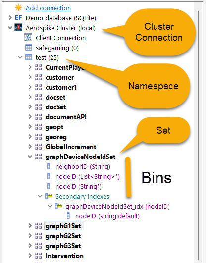The LINQPad connection pane will display the different [Aerospike components](https://docs.aerospike.com/server/architecture/data-model) in an hierarchical manner where namespace is under Aerospike cluster connection. Aerospike Sets are under namespaces and bins are under Sets. Below screenshot shows the relationship between these components:

Each component can be dragged-and-dropped onto the LINQPad Query pane to be executed by LINQPad. The execution behavior will depend on the component. For example, a Set or Secondary Index will present the records within that component. For other components, the properties are displayed. In all cases, you can always execute the driver’s extension methods. These extension methods greatly simplify Aerospike API commands like [Get, Put, Query, Operate, etc](https://developer.aerospike.com/client/csharp). plus, the ability to perform things like importing or exporting data. Of course, you can always use LINQ against Aerospike Sets or Secondary Indexes. Below is an example of some of the driver extensions:

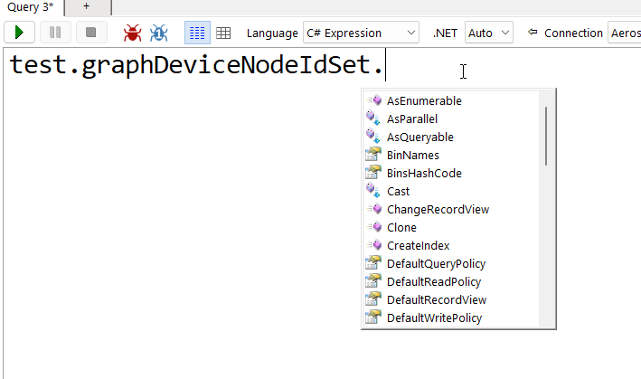

## Cluster and Namespace Configuration Information

Information about the cluster and namespaces can be obtained in the LINQPad connection pane. Below is an example showing cluster level information which includes the enabled features, configuration, nodes, version, total namespaces and sets, etc.

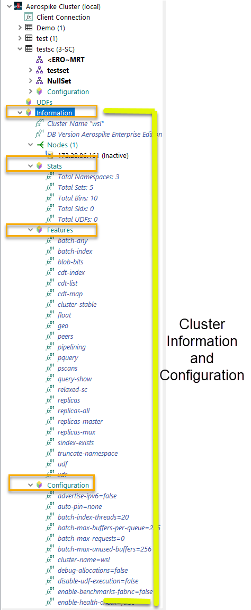

Below is an example of the namespace configuration information that is presented under the namespace icon.

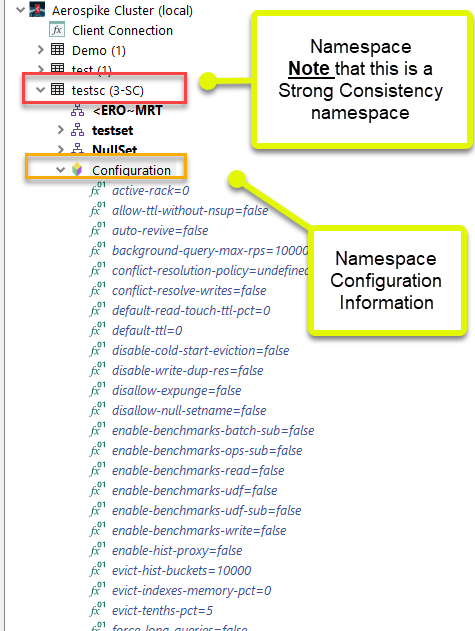

## Aerospike Namespace, Set, Records, Bins, and Secondary Indexes

Aerospike Sets and records are very easy to use. The detected bins in a record are integrated into LINQPad and are treated as C\# properties. As such, features like IntelliSense and Autocompletion just work. You can also access bins within a record by using the bin name.

Since Aerospike is a schemaless database, a record can consist of varying number of bins, or a bin can have different data types between records. The driver can handle these conditions seamlessly.

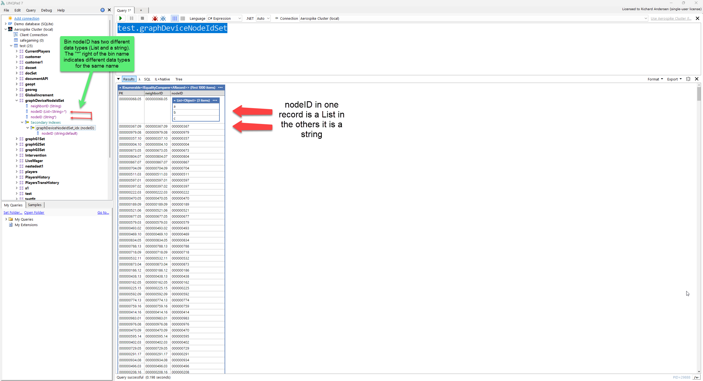

Implicit data conversion ([auto-values](#auto-values)) eliminates the need to test and casts a bin’s value so that it can be used directly in any operation. Below is an example that shows how implicit conversion works. The set, “graphDeviceNodeIdSet”, has a bin named “nodeID” that consists of two different data type values. Some records have a list value while others have a string value. This example uses the “where” clause which compares each record in the set looking for a numeric value of 367 or the value “a” in the list values.  
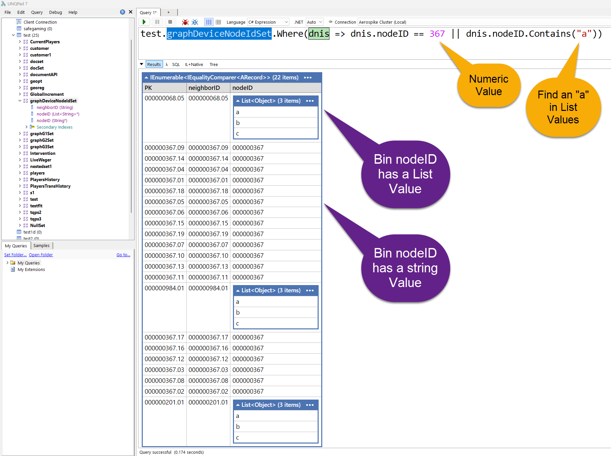

## User-Defined Functions (UDFs)

The driver supports the execution of UDFs by calling the Execute extension method. The Execute method will reflect the actual arguments used in the UDF. Below is an example:

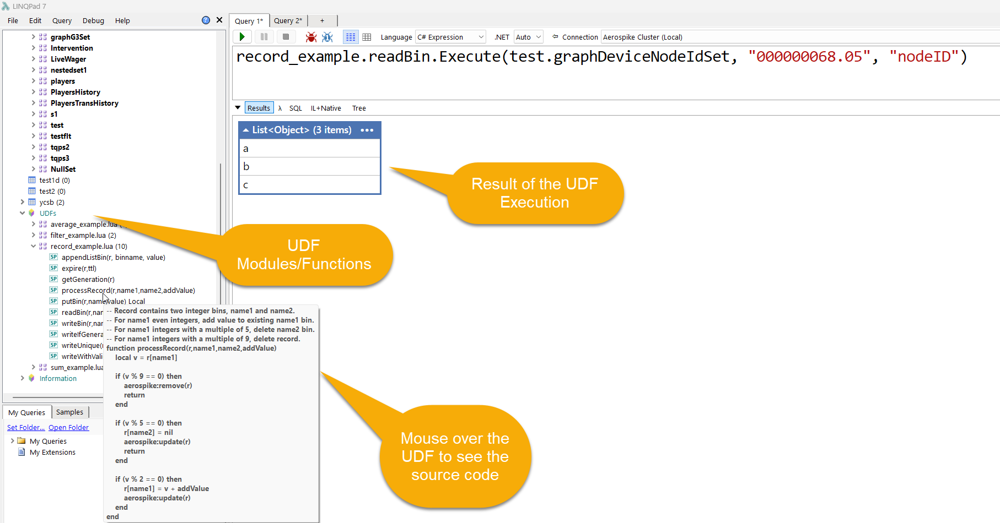

## Aerospike API

At any time, you can use the underlying Aerospike API directly or a combination of API or driver extension methods. Below is an example:

```
void Main() 
{ 
    //Using Aerospike API 
     
    var cPolicy = new ClientPolicy(); 
    using var client = new AerospikeClient(cPolicy, "localhost", 3000); 

    //Insert 3 records, with MapPolicy KEY_ORDERED 

    var key1 = new Key("test", "s1", 1); 
    var key2 = new Key("test", "s1", 2); 
    var key3 = new Key("test", "s1", 3); 
    var policy = new WritePolicy(); 
    policy.recordExistsAction = RecordExistsAction.UPDATE; 

    client.Put(policy, key1, new Bin("id", "groupID1")); 
    client.Put(policy, key2, new Bin("id", "groupID2")); 
    client.Put(policy, key3, new Bin("id", "groupID3")); 

    for (int i = 0; i < 25; i++) 
    { 
        client.Operate(null, key1, 
                        ListOperation.Insert("myList", 0, Value.get(value)), 
                        ListOperation.Trim("myList", 0, 20) ); 
    } 

}
```

## Serialization/Object-Mapper

The driver supports serialize and deserialize any C\# object to/from an Aerospike record. Native C\# types are stored as Aerospike data type. Unsupported types like [DateTime](https://learn.microsoft.com/en-us/dotnet/api/system.datetime?view=net-8.0), [DateTimeOffset](https://learn.microsoft.com/en-us/dotnet/api/system.datetimeoffset?view=net-8.0), [Timespan](https://learn.microsoft.com/en-us/dotnet/api/system.timespan?view=net-8.0), etc. are serialized as an ISO string or a numeric value based on behavior defined in the connection dialog. This behavior can also be changed programmability by the driver’s API or by providing a custom serializer.

C\# collections will be serialized into an Aerospike CDT. C\# public properties or fields will be serialized into an Aerospike bin where the bin name is the same name as the property/field. Fields can be ignored, and bin names can be different based on the use of C\# attributes (Aerospike.Client.BinIgnore, Aerospike.Client.BinName). Any nested class will be serialized as an Aerospike JSON document.

The driver can deserialize an Aerospike record into a C\# class. Just like serialization, bins are mapped to properties and fields using attributes as defined above. The driver will determine the best possible constructor to instantiate the class. This behavior can be changed by using the “Aerospike.Client.Constructor” attribute. Below is an example:

```
//This is from the POCO Aerospike LINQPad Example script
void Main()
{
	//If true, the read record is re-written with a different PK to demo how PICO are written back to the DB.
	var reWriteAsDiffPK = true;
	
	var customerInvoices = Demo.CustInvsDoc
							.AsEnumerable()
							.Select(cid => cid.Cast<Customer>(cid.PK)).ToArray();

	customerInvoicescustomerInvoices.OrderBy(i => i.LastName)
									.ThenBy(i => i.LastName)
									.ThenBy(i => i.Id)
									.Dump("Customer Invoices class instances created from the DB", 0);
	
	
	if(reWriteAsDiffPK)
	{
		var newRecs = new List<long>();
		
		foreach (var element in customerInvoices)
		{
			var newPK = element.Id * 1000; //Change the PK
			
			//Create DB Records from the Customer instances
			Demo.CustInvsDoc.WriteObject(newPK, element);
			newRecs.Add(newPK); //Removed new record later...
		}
		
		/Note that bin "Fax" is present in the DB (and list as a known bin in the Set's Bin list pane) but not as a property in the Customer Class
		//	Also bin "Company" is present in the DB and wasn't detected by the Set's Bin list pane and isn't a property either. 
		//		As such, records that have defined "Company" bin, will have an ExpandoObject value indicating that records has additional bins.
		Demo.CustInvsDoc.AsEnumerable()
						.OrderBy(cid => cid.LastName)
						.ThenBy(cid => cid.FirstName)
						.ThenBy(cid => cid.PK)
						.Dump("Customer Invoices Docs set From DB (rewritten with new PKs)", 1);

		LINQPad.Util.ReadLine("Press <Enter> to continue and remove newly written records!".Dump());

		foreach (var removePK in newRecs)
		{
			Demo.CustInvsDoc.Delete(removePK);
		}
	}
}

//Class definations for Customer and Invoice
public class Customer
{	
	/// <summary>
	/// The constructor used to create the object. 
	/// Note that the property "Invoices" will be set using the accessor. 
	/// </summary>
	[Aerospike.Client.Constructor]
	public Customer(long id,
					string address,
	                string city,
					string country,
					string email,
					string firstName,
					string lastName,
					string phone,
					string postalCode,
					string state, 
					int supportRepId)
	{
		this.Id = id;
		this.Address = address;
		this.City = city;
		this.Country = country;
		this.Email = email;
		this.FirstName = firstName;
		this.LastName = lastName;
		this.Phone = phone;
		this.PostalCode = postalCode;
		this.State = state;
		this.SupportRepId = supportRepId;
	}
	
	/// <summary>
	/// This property will contain the primary key value but will not be written in the set as a bin. 
	/// </summary>
	[Aerospike.Client.PrimaryKey]
	[Aerospike.Client.BinIgnore]
	public long Id { get; }
	public string Address{ get; }	
	public string City { get; }	
	public string Country { get; }	
	public string Email { get; }
	public string FirstName { get; }
	public string LastName	{ get; }
	public string Phone { get; }
	public string PostalCode { get; }
	public string State { get; }
	public int SupportRepId { get; }
	public List<Invoice> Invoices { get; set; }
}

public class Invoice
{	
	[Aerospike.Client.Constructor]
	public Invoice(string billingAddress,
					string billingCity,
					string billingCountry,
					string billingCode,
					string billingState,
					DateTime invoiceDate,
					decimal total,
					List<InvoiceLine> lines)
	{
		this.BillingAddress = billingAddress;
		this.BillingCity = billingCity;
		this.BillingCode = billingCode;
		this.BillingState = billingState;
		this.BillingCountry = billingCountry;
		this.InvoiceDate = invoiceDate;
		this.Total = total;
		this.Lines = lines;
	}
	
	/// <summary>
	/// Uses the bin name BillingAddr instead of the property name.
	/// </summary>
	[Aerospike.Client.BinName("BillingAddr")]
	public string BillingAddress { get;}
	public string BillingCity { get; }		
	[Aerospike.Client.BinName("BillingCtry")]
	public string BillingCountry { get; }
	public string BillingCode { get; }
	public string BillingState { get; }
	/// <summary>
	/// Notice that the driver will convert the DB value into the targed value automatically.
	/// The value is stored as a sting in the DB but converted to a date/time. Upon write it will be converted from back to a native DB type (e.g., string or long depending on configuration).
	/// </summary>
	public DateTime InvoiceDate { get; }
	/// <summary>
	/// This is stored as a double in the DB but is automatically converted to a decimal.
	/// </summary>
	public Decimal Total { get; }
	public IList<InvoiceLine> Lines { get; }
}

public class InvoiceLine
{
	[Aerospike.Client.Constructor]
	public InvoiceLine(long invoiceId,
						long quantity,
						long trackId,
						decimal unitPrice)
	{
		this.InvoiceId = invoiceId;
		this.Quantity = quantity;
		this.TrackId = trackId;
		this.UnitPrice = unitPrice;
	}

	public long InvoiceId { get; }
	public long Quantity { get; }
	public long TrackId { get; }
	public decimal UnitPrice { get; }
}
```

Below is the output from LINQPad:

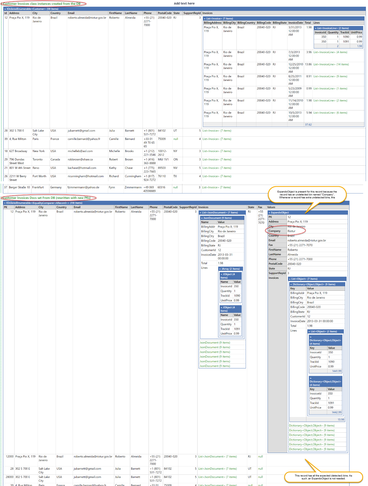

## Json Support

You can read and write Json to or from an Aerospike namespace, set, or record by means of the “ToJson” and “FromJson“ methods. The driver supports embedded JSON data types which are compatible with Json generated from multiple databases. The driver uses [Json.Net](https://www.newtonsoft.com/json) when working with Json.

## Document API

The driver supports the use of the Aerospike Document API. This feature can be turned on or off from within the connection dialog. Below is an example where we obtain all artist recording track 2527 purchased by a customer.

```
    //ORM -- Find all tracks for TrackId 2527 and return those customers who bought this track
	var fndTrackIdsInstances = from custInvoices in Demo.CustInvsDoc.AsEnumerable()
							   let custInstance = custInvoices.Cast<Customer>()
							   where custInstance.Invoices
									   .Any(d => d.Lines.Any(l => l.TrackId == 2527))
							   select custInstance;
	fndTrackIdsInstances.Dump("Found Using ORM/POCO", 0);

	//.Net CDTs -- Find all tracks for TrackId 2527 and return those customers who bought this track
	// BTW you can configure how documents from Aerospike are presented.
	//	The default is to treat documents as JObject but you can configure this (via the connection properties)
	//	to present them as .Net CDTs (i.e., List and Dictionary).
	var fndTrackIdsCDT = from custInvoices in Demo.CustInvsDoc.AsEnumerable()
						 let custInvoiceLines = custInvoices.Invoices.ToCDT() //Not required if document mode was disabled
						 where custInvoiceLines
								   .SelectMany(il => ((IList<object>)il["Lines"]).Cast<IDictionary<string, object>>())
								 .Any(l => (long)l["TrackId"] == 2527)
						 select custInvoices;
	fndTrackIdsCDT.Dump("Found Using Linq CDT", 0);

	//JObject -- Find all tracks for TrackId 2527 and return those customers
	var fndTrackIdsJObj = from custInvoices in Demo.CustInvsDoc.AsEnumerable()
						  let custInvoiceLines = custInvoices.ToJson()["Invoices"]
													  .Children()["Lines"].Children()
						  where custInvoiceLines.Any(l => l["TrackId"].Value<int>() == 2527)
						  select custInvoices;

	fndTrackIdsJObj.Dump("Found Using Linq JObject", 0);

	//Json Pathing -- Find all tracks for TrackId 2527 and return those customers
	var fndTrackIdsJPath = from custInvoices in Demo.CustInvsDoc.AsEnumerable()
						   where custInvoices.Invoices.ToJArray().SelectToken("$..Lines[?(@.TrackId == 2527)]") != null
						   select custInvoices;
	fndTrackIdsJPath.Dump("Found Using Json Path", 0);
```

Below is the output from LINQPad:

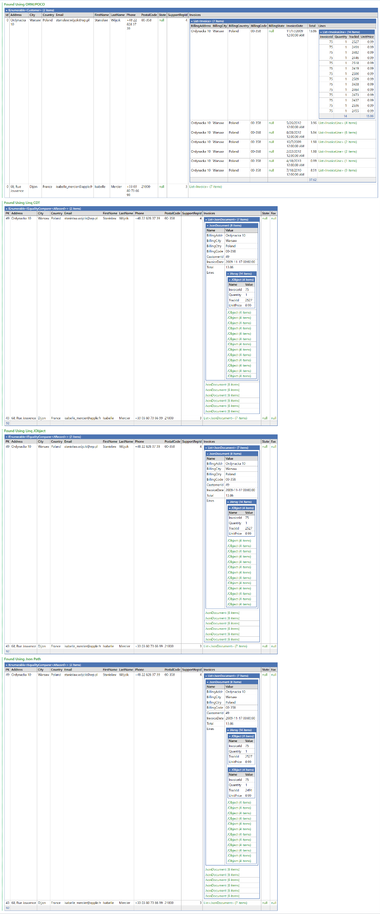

## Importing/Exporting

The driver can import a valid JSON file into an Aerospike namespace or set from many different external databases via the “ImportJsonFile” method. Each JSON property will be mapped to an Aerospike bin, JSON collection types will be transformed into the corresponding Aerospike CDT, nested JSON objects will be treated as Aerospike JSON documents, etc. This behavior can be controlled via the method’s arguments and connection dialog properties. Aerospike supports the following common in-line JSON types:

-   \$date, \$datetime -- This can include an optional sub–Json Type. Example:  
    bucket_start_date: { \$date: { \$numberLong: 1545886800000}}
-   \$datetimeoffset -- This can include an optional sub–Json Type. Example:  
    bucket_start_datetimeoffset: { \$datetimeoffset: { \$numberLong: 1545886800000}}
-   \$timespan -- This can include an optional sub-Json Type. Example:  
    bucket_start_time: { \$timespan: { \$numberLong: 1545886800000}}
-   \$timestamp
-   \$guid, \$uuid
-   \$oid -- If the Json string value equals 40 in length it will be treated as a digest and converted into a byte array. Example:  
    \_id: { \$oid: 0080a245fabe57999707dc41ced60edc4ac7ac40 } \_id:[00 80 A2 45 FA BE 57 99 97 07 DC 41 CE D6 0E DC 4A C7 AC 40]
-   \$numberint64, \$numberlong
-   \$numberint32, \$numberint
-   \$numberdecimal
-   \$numberdouble
-   \$numberfloat, \$numbersingle
-   \$numberint16, \$numbershort
-   \$numberuint32, \$numberuint
-   \$numberuint64, \$numberulong
-   \$numberuint16, \$numberushort
-   \$bool, \$boolean

Below is an example of importing the Shipwreck sample dataset into the “Demo” namespace and creating the Aerospike set “shipwrecks”.

```
Demo.ImportJsonFile(@"C:\MonogoDBSampleCollection\shipwrecks.json", "shipwrecks")
```

The driver can also export and import between Aerospike cluster and/or namespaces and sets using the Export and Import methods. Below is an example of an export from the “players” Aerospike set.

```
test.players.Export(@"c:\users\randersen_aerospike\Desktop\player.json");
```

Below is an example of importing a JSON file:

```
test.players.Import(@"c:\users\randersen_aerospike\Desktop\player.json"); 
test.Import(@"c:\users\randersen_aerospike\Desktop\player.json", "players");
```

## Encryption and Authentication

Support for TLS encryption and authentication is fully supported by enabling these options in the connection dialog. This includes using the LIINQPad Password Manager integration. If the password manager is not used, all passwords are encrypted using the Windows Data Protection API.

## Connection Dialog

The connection dialog is used to establish a connection to an Aerospike cluster.

This dialog also defines the connection [policies](https://aerospike.com/docs/server/guide/policies) and Aerospike LINQPad features. Each field/property will typically have a “tooltip” providing additional information. Blue underlined text is a hyperlink that will take you to additional information about the topic.

The dialog is divided into multiple sections.

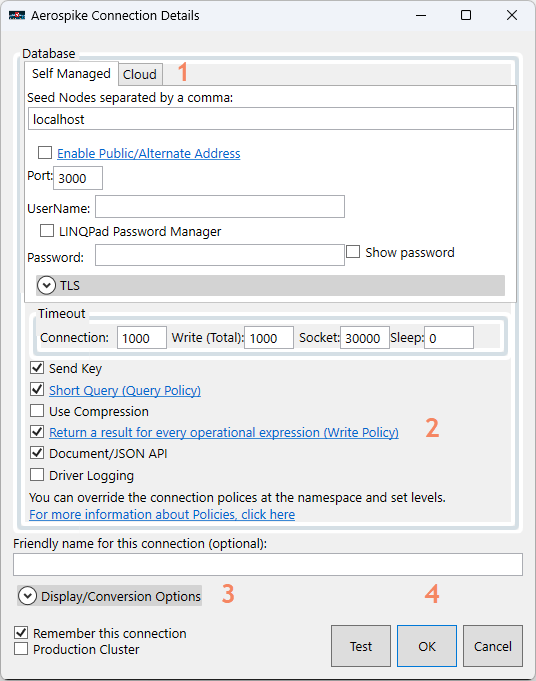

The sections are:

1.  Self-Managed. Each tab provides the parameters needed to connect to an Aerospike cluster based on the targeted platform.
2.  This section provides the general policies and features used by the [Aerospike C\# driver](https://github.com/aerospike/aerospike-client-csharp) or LINQPad feature.
3.  Display/Conversion Options expansion panel, provides the options needed for auto-set bin discovery, serialization/deserialization options, use of [auto-values](#auto-values), record display views, etc.
4.  Buttons are used to determine if the options are saved, canceled, or to test the connection.

### Self-Managed Tab

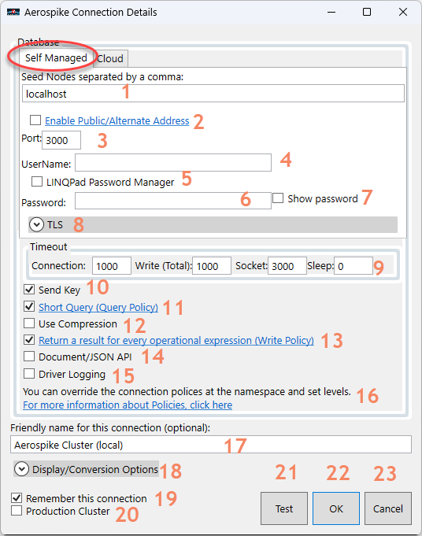

This tab is used to [connect to a self-managed/native Aerospike cluster](https://aerospike.com/docs/connect/kafka/to-asdb/configuring/aerospike).

The properties are:

1.  [An Aerospike node or a list of nodes separated by a comma](https://aerospike.com/docs/server/guide/client-connection#:~:text=An%20Aerospike%20cluster%20consists%20of,other%20nodes%20in%20the%20cluster.).
2.  A checkbox when enabled will indicate that this cluster will be connected typically to a public IP address. For more information [click-here](https://aerospike.com/docs/apidocs/csharp/html/f_aerospike_client_clientpolicy_useservicesalternate).
3.  The node’s client port for connection.
4.  The username if [authentication](https://aerospike.com/docs/server/operations/configure/security/access-control) is enabled.
5.  If enabled, the built-in LINQPad password manager is used. When enabled, a dropdown will be displayed to select your Password Name you defined in the manager. The Password Manager can be found on the File menu of LINQPad.
6.  The associated password of the user.
7.  If checked, it will show the password in plain text.
8.  This expansion panel will display the TLS options (see below).
9.  This panel are the options regarding timeout values. Each field will have a tooltip explaining the field.
10. If enabled, “send key” sends the user-defined key in addition to hash digest on both reads and writes. If the key is sent on a write, the key will be stored with the record on the server and returned to the client on primary and secondary index queries.
11. If enabled, queries are expected to return less than 100 records per node and the servers will optimize the queries for a small record set.
12. If enabled, compression is used (only applies to Self-Managed clusters).
13. Controls how “operate” API function behaves. For more information [click-here](https://aerospike.com/docs/apidocs/csharp/html/f_aerospike_client_writepolicy_respondallops).
14. Enables the Document/JSON feature. See Document API section above. If disabled, collections are treated as .net collections.
15. If enabled, the internal Aerospike API debugging/trace is enabled.
16. The hyperlink will take you to the documentation regarding the driver’s policies.
17. The name of the connection. It will default to “Aerospike Cluster” is not provided.
18. The Display/Conversion Options expansion panel (see below).
19. If enabled, the connection properties and features are persisted so that the connection can be used between LINQPad sessions.
20. If enabled, this connection is considered “production only” and certain operations like “truncate” are not allowed.
21. If pressed, the connection properties are used to establish a test connection to the cluster.  
    **Note**: If you enabled TLS the provided certificate is validated.
22. Closes the dialog and makes the connection available to LINQPad.
23. Closes the dialog and none of the changes are saved/persisted.

### TLS Panel (only Self-Managed Clusters)

The options needed to establish a [TLS connection to an Aerospike cluster](https://aerospike.com/docs/server/operations/configure/network/tls).

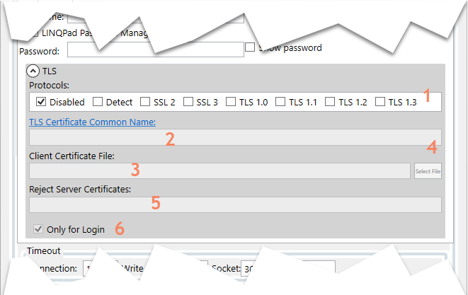

Fields are:

1.  The [TLS protocols](https://aerospike.com/docs/server/guide/security/tls) that can be used. Multiple protocols can be selected.
2.  The common name (i.e., Issue To) that was used in the certificate. For more information [click here](https://aerospike.com/docs/apidocs/csharp/html/f_aerospike_client_host_tlsname).

    **Note**: If you leave this blank and press the “Test” button, the certificate is validated, and this field is filled on the value found in the certificate.

3.  The client certificate file as a path. You can select the file by pressing the “Select a File” button on the far right.  
    **Note**: If you press the “**Test**” button, the certificate is validated ensuing that the chaining and TLS Common Name are correct. It ensures that the certificate is not expired.
4.  Select the client certificate file.
5.  Reject server certificates whose serial numbers match.
6.  If enabled, TLS is only used for authentication (login).

### Cloud Tab

Aerospike Cloud will be available in a future release.

### Display/Conversion Options Panel

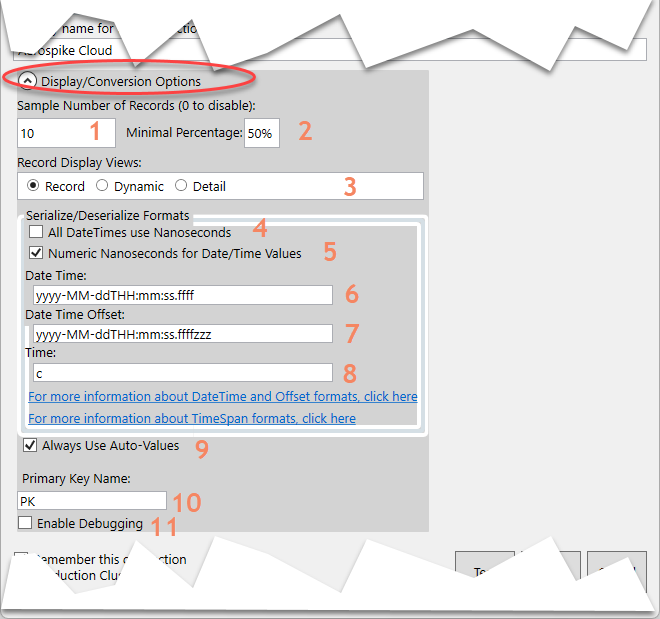

This panel provides information on how to handle things like serialization, Set-Bin Datatype discovery, conversion, etc.

The fields are:

1.  The number of records that need to be read from a set to determine the bins and data types for an Aerospike Set. If zero, the Set-Bin Datatype discovery is disabled, and the Record Display View will default too “Dynamic”.
2.  The number of records that are read as a percent of the total sample read value for the LINQPad driver to determine what bins and datatypes are part of that set. For example, If the sampling is 10, and the minimal percentage is 50%. If a set only had four records (needed at least five), the LINQPad driver will not use those four records to determine the bins/data types for that set.
3.  The Record Display View field determines how records are displayed (dumped) in LINQPad.
    1.  Record – Only applies if Set-Bin Datatype discovery is enabled (record sampling is not zero) and the LINQPad driver was able to discover the set’s bins and datatypes. Records in this set are displayed in a column/grid format where each column head is the bin name. See below for an example.
    2.  Dynamic – This is the default view if a set’s bins could not have been discovered, when there are extra undetected bins in a set’s record, or a record error/exception occurred. See below for an example.
    3.  Detail – All properties of the record (including hidden properties) are displayed.
4.  Only when converting to/from .Net Date/Time object.
    1.  If enabled:
        1.  To a Date/Time object the associated Aerospike bin must be an INT type where that number will represent the number of nanoseconds from UNIX epoxy time and converted to the .Net Date/Time.
        2.  From a .Net Date/Time object, it is converted to nanoseconds from UNIX epoxy time and saved into the associated bin as a INT type.
    2.  If disabled:
        1.  To a Date/Time object the associated Aerospike bin value will determine how the conversion will be determined. If a string, the sting will be parsed based on the defined formats to create the .Net Date/Time.
        2.  From a Date/Time object, the string format of the object is used based on the defined date/time format.
5.  In conjunction with the field above (use nanoseconds). If enabled the numeric value is the number of nanoseconds from UNIX epoxy time. If disabled, this would be the number of .Net ticks since midnight on January 1st in the year 1AD.
6.  The format used to convert a Date/Time to/from a string.
7.  The format used to convert a Date/Time with offset to/from a string.
8.  The format used to convert a Time to/from a string.
9.  If enabled, [auto-values](#_Auto-Values) are always used. This eliminates the use of casting for bin values plus reduces the strong typing of C\#. If disable, bin values will be strongly typed.
10. The default property name of primary keys.
11. If enabled, internal LINQPad driver debugging is enabled which includes persisting of the dynamic C\# classes to the LINQPad script folder.

Below is an example of Record Display View:

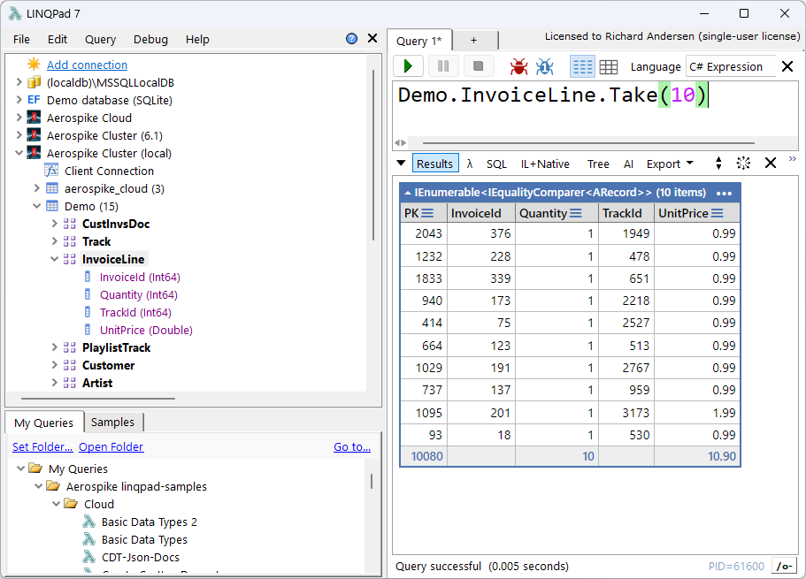

Below is an example of Dynamic Display View:

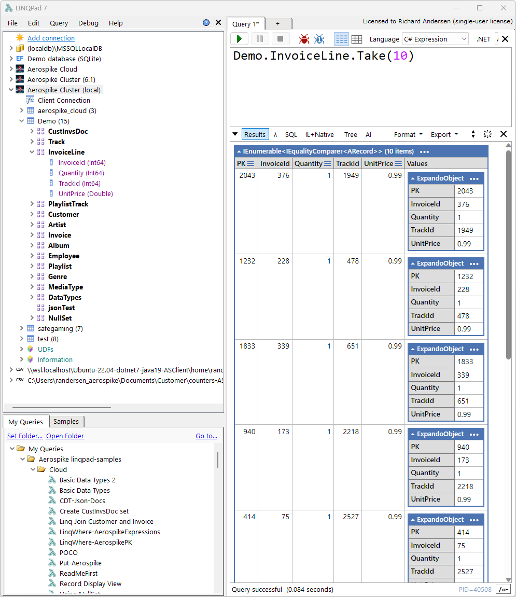

## Auto-Values

Auto-Values are a wrapper around Aerospike DB values so that working with unstructured data is simple and risk free of exceptions like null reference and invalid cast.

They provide a rich set of functions to work with conversions from or to DB and .Net values. They have the following main features:

-   Implicit Casting – don’t have to worry about check and cast. Just use the standard .Net operators.
-   Convert functions – Will try to convert a DB or .Net value with or without any explicit reference.
-   Contains, TryGetValue, FindAll, ElementAt, etc. functions – Search/Match/Access functions used to find a value within a CDT or match a single non-CDT value.

For more information, see the [Auto-Values blog](https://aerospike.com/developer/blog/how-to-use-auto-values-in-nosql-linqpad-driver).

## Working with the “null” Set

You can still perform queries and API calls using the driver’s extension APIs against the [“null” set](https://aerospike.com/docs/server/operations/manage/sets). Below is an example of an API call to obtain the records for Aerospike set “Artist”:

test.NullSet.Where(ns =\> ns.Aerospike.SetName == "Artist")

Below is the output:

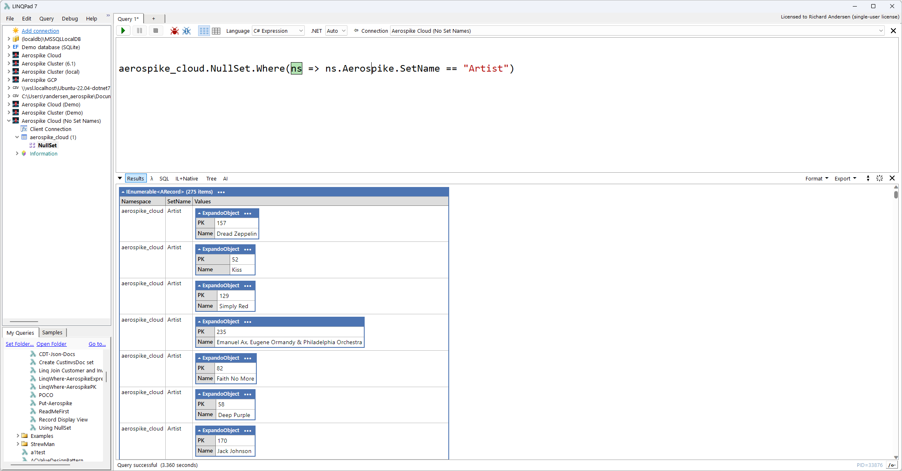

## Code Generation

The driver can generate Get, Put, and Batch statements from a result set. The code generated can be the Aerospike native API or the LINQPad extended API. Below are some examples of generating native API for batch statements:

```
testsc.Track.Take(3).ToAPICodeBatch(useAerospikeAPI: true)

ASClient.Get(null, new List<BatchRead>(){
                   new BatchRead(null, new Key("testsc", "Track", 2984L), true),
                  new BatchRead(null, new Key("testsc", "Track", 782L), true),
                  new BatchRead(null, new Key("testsc", "Track", 3192L), true)})

ASClient.Operate(null, 
                    new List<BatchRecord>(){
                        new BatchWrite(null,
                            new Key("testsc", "Track", 2984L),
                            new Operation[] {
                                Operation.Put(new Bin("AlbumId", Value.Get(236L))),
                                Operation.Put(new Bin("Bytes", Value.Get(10227333L))),
                                Operation.Put(new Bin("Composer", Value.Get("Bono, The Edge, Adam Clayton, and Larry Mullen"))),
                                Operation.Put(new Bin("GenreId", Value.Get(1L))),
                                Operation.Put(new Bin("MediaTypeId", Value.Get(1L))),
                                Operation.Put(new Bin("Milliseconds", Value.Get(315167L))),
                                Operation.Put(new Bin("Name", Value.Get("If You Wear That Velvet Dress"))),
                                Operation.Put(new Bin("UnitPrice", Value.Get(0.99D)))}),
                        new BatchWrite(null,
                            new Key("testsc", "Track", 3192L),
                            new Operation[] {
                                Operation.Put(new Bin("AlbumId", Value.Get(250L))),
                                Operation.Put(new Bin("Bytes", Value.Get(255245729L))),
                                Operation.Put(new Bin("GenreId", Value.Get(19L))),
                                Operation.Put(new Bin("MediaTypeId", Value.Get(3L))),
                                Operation.Put(new Bin("Milliseconds", Value.Get(1278333L))),
                                Operation.Put(new Bin("Name", Value.Get("Boys and Girls"))),
                                Operation.Put(new Bin("UnitPrice", Value.Get(1.99D)))}),
                        new BatchWrite(null,
                            new Key("testsc", "Track", 782L),
                            new Operation[] {
                                Operation.Put(new Bin("AlbumId", Value.Get(62L))),
                                Operation.Put(new Bin("Bytes", Value.Get(7832790L))),
                                Operation.Put(new Bin("Composer", Value.Get("Ian Gillan/Ian Paice/Jon Lord/Ritchie Blckmore/Roger Glover"))),
                                Operation.Put(new Bin("GenreId", Value.Get(1L))),
                                Operation.Put(new Bin("MediaTypeId", Value.Get(1L))),
                                Operation.Put(new Bin("Milliseconds", Value.Get(239830L))),
                                Operation.Put(new Bin("Name", Value.Get("Never Before"))),
                                Operation.Put(new Bin("UnitPrice", Value.Get(0.99D)))})})
```

## Multi-Record Transactions (MRT)

The LINQPad driver supports Aerospike MRTs using the Aerospike native API and the extension API.

The extension API manages the associated policies for easy use. Below are the extension API functions:

-   CreateTransaction – Creates the MRT (i.e., Begin Transaction)
-   Commit – Commits the associated MRT. It handles the “In-Doubt” retry logic.
-   Abort – Aborts the associated MRT (i.e., rollback)

Calling “CreateTransaction” which will return an ATransaction object which acts like a namespace object. All the extension APIs (e.g., Get, Put, CopyRecods, Import, etc.) can be used with MRT with no effort.

Like always if you wish to use the Aerospike native API you can at any time. The default policies for the Extension MRT “set” or “namespace” will be properly enabled to support native MRTs.

For more information about Aerospike MRTs [see this page](https://aerospike.com/blog/aerospike8-transactions/). For more information about the MRT extensions, see the MRT.linq file in the LINQPad sample section/folder.

## Examples

Sample scripts can be found in the [LINQPad Sample tree view tab](https://www.linqpad.net/nugetsamples.aspx) under “nuget” or in the “linqpad-samples” [folder](https://github.com/aerospike-community/aerospike-linqpad-driver/tree/main/linqpad-samples) in GitHub.

The sample scripts are:

-   ReadMeFirst.linq – This script should be reviewed first. It will load the data into the “test” namespace which needs to exist. To create this namespace, please follow these [instructions](https://docs.aerospike.com/server/operations/manage/namespaces).
-   Basic Data Types.linq - Review some of the capabilities of working with Bins from within the driver plus show how to programmatically access sets and bins.
-   Basic Data Types 2.linq – Additional examples working with set properties and auto-values (AValue).
-   Record Display View.linq - This demonstrates how "Record Display View" works.
-   Linq Join Customer and Invoice.linq – Shows how to perform a client side join of two sets.
-   LinqWhere-AerospikePK.linq – Shows how to use primary keys with Linq and Aerospike API.
-   LinqWhere-AerospikeExpressions.linq – Shows how to use a Linq Where clause and the use of Aerospike Filter [Expressions](https://docs.aerospike.com/server/guide/expressions).
-   POCO.linq – Show the use of the ORM between complete class structures and the Aerospike DB.
-   Put-Aerospike.linq – Shows the use of the how to insert or update a record within a set using a primary key.
-   CDT-Json-Docs.linq – Show the use of CDTs (Collection Data Types), Json, and documents by means of Linq and Aerospike [Expressions](https://docs.aerospike.com/server/guide/expressions).
-   Using NullSet.linq – This shows the use of the [Null Set](https://aerospike.com/docs/server/architecture/data-model).
-   Generate Code.linq – This shows how to generate API code from record collections.
-   MRT.linq – This shows how to use MRTs

## API Documentation

LINQPad API documentation can be found [here](https://github.com/aerospike-community/aerospike-linqpad-driver/blob/main/Help/index.html).

## Prerequisites

-   [LINQPad 8](https://www.linqpad.net/LINQPad8.aspx): [.NET 8](https://dotnet.microsoft.com/download/dotnet/8.0)/[.NET 7](https://dotnet.microsoft.com/download/dotnet/7.0)/[.NET 6](https://dotnet.microsoft.com/download/dotnet/6.0)
-   [LINQPad 7](https://www.linqpad.net/LINQPad7.aspx): [.NET 7](https://dotnet.microsoft.com/download/dotnet/7.0)/[.NET 6](https://dotnet.microsoft.com/download/dotnet/6.0)

# 

# Installation of LINQPad Driver

## LINQPad NuGet Manager (Windows Only)

-   Open LINQPad
-   Click `Add Connection` Link.
-   Click button `View more drivers…`
-   Click radio button “`Show all drivers”` and type `Aerospike`.
-   Click Install

## Manual and MacOS

Obtain the latest driver from the `Driver` folder and [download](https://github.com/aerospike-community/aerospike-linqpad-driver/tree/main/Driver) to your computer.

-   Open LINQPad
-   Click `Add Connection` Link.
-   Click button `View more drivers…`
-   Click button `Install driver from .LPX6 file…` and select downloaded lpx6 file.

# Installation of the Aerospike Database

There are multiple ways to install Aerospike DB.

-   [Docker and Linux](https://docs.aerospike.com/server/operations/install)
-   [AeroLab](https://github.com/aerospike/aerolab)

# Other Resources

-   <https://www.linqpad.net/>
-   <https://aerospike.com/>
-   <https://developer.aerospike.com/>
-   <https://developer.aerospike.com/blog>
-   <https://github.com/aerospike>
-   <https://github.com/aerospike-community>
-   <https://github.com/aerospike-community/aerospike-linqpad-driver/blob/main/Help/index.html>
