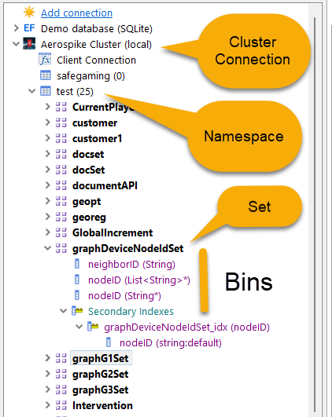

# Aerospike LINQPad Driver

Use [LINQPad 9](https://www.linqpad.net/LINQPad9.aspx) to explore, query, and update Aerospike from C# on Windows or macOS.

The driver creates a dynamic LINQPad data context from an Aerospike connection. Namespaces, sets, bins, secondary indexes, UDFs, and cluster metadata appear in LINQPad's connection explorer, where they can be inspected, dragged into a query, and used with IntelliSense.

> The current project targets **.NET 8** and packages the driver for LINQPad 9+.

For a visual feature tour, see the **[Aerospike LINQPad Driver feature overview](FEATURES.md)**.

## Highlights

- Query sets and secondary indexes with LINQ.
- Read, write, delete, batch, operate, import, export, and truncate through driver helpers.
- Use the native [Aerospike C# client](https://docs.aerospike.com/develop/client/csharp/) whenever lower-level control is needed.
- Work with sparse and mixed-type bins through [`AValue`](README_AVALUES.md) and `APrimaryKey`.
- Map records to and from C# objects, JSON, documents, maps, and lists.
- Inspect cluster, namespace, set, bin, index, and UDF metadata from the connection tree.
- Create and manage Aerospike multi-record transactions.
- Generate LINQPad-driver or native-client code from existing records.
- Build connection-aware prompts for [LINQPad AI](README_AI_FEATURES.md).



## Quick start

### 1. Install the driver

In LINQPad:

1. Select **Add connection**.
2. Select **View more drivers**.
3. Choose **Show all drivers** and search for `Aerospike`.
4. Install **Aerospike Database LINQPad Driver**.

For a local build, install the generated driver package instead. See [Building and packaging](docs/development.md).

### 2. Create a connection

Create an Aerospike connection and provide at least one seed host and the service port. The normal local-development defaults are:

```text
Seed host: localhost
Port:      3000
```

Use **Test** before saving the connection. Authentication, TLS, public/alternate addresses, timeouts, record sampling, Auto Values, and production safeguards are described in the [connection guide](docs/connection-configuration.md).

### 3. Run the sample setup

Open `linqpad-samples/Demo/ReadMeFirst.linq` and follow its setup notes. The sample scripts expect an Aerospike namespace named `test` unless you adapt the connection and namespace names.

See the [sample catalog](linqpad-samples/README.md) for the recommended order.

### 4. Run a bounded query

Assuming the sample `Customer` set is available:

```csharp
var customers =
    from customer in test.Customer.AsEnumerable()
    where customer.State == "CA"
    orderby customer.LastName, customer.FirstName
    select new
    {
        customer.PK,
        customer.FirstName,
        customer.LastName,
        customer.Email
    };

customers.Take(100).Dump();
```

`AsEnumerable()` switches the generated set to ordinary LINQ-to-Objects operations. This is convenient for interactive exploration, but it means records are materialized before the LINQ predicate is applied. For server-side filtering, use an Aerospike expression:

```csharp
var filterExpression = Aerospike.Client.Exp.EQ(
    Aerospike.Client.Exp.StringBin("State"),
    Aerospike.Client.Exp.Val("CA"));

test.Customer
    .Query(filterExpression)
    .Take(100)
    .Dump();
```

Read [Querying and records](docs/querying-and-records.md) for the distinction between driver-side LINQ, server-side expressions, primary-key reads, and secondary-index queries.

## Documentation

| Topic | Start here |
|---|---|
| Visual product and feature overview | [Feature overview](FEATURES.md) |
| Installation and first connection | [Getting started](docs/getting-started.md) |
| Connection, TLS, timeouts, sampling, and display | [Connection configuration](docs/connection-configuration.md) |
| Sets, records, LINQ, expressions, keys, and indexes | [Querying and records](docs/querying-and-records.md) |
| `AValue`, `APrimaryKey`, conversions, maps, lists, and CDTs | [Auto Values](docs/auto-values/README.md) |
| POCO mapping, JSON, and document operations | [Data mapping and documents](docs/data-mapping-and-documents.md) |
| Writes, batch operations, import/export, UDFs, and MRT | [Data operations](docs/data-operations.md) |
| Code generation, native API access, and advanced capabilities | [Advanced features](docs/advanced-features.md) |
| AI-assisted query and code generation | [AI features](docs/ai-features.md) |
| Included `.linq` scripts and demo data | [Sample catalog](linqpad-samples/README.md) |
| Full documentation map | [Documentation index](docs/README.md) |
| Generated API reference | [Hosted API documentation](https://aerospike-community.github.io/aerospike-linqpad-driver/) |

## Important concepts

### Generated sets and record properties

The driver samples records to discover common bins and generate C# properties. Aerospike remains schemaless: a record can omit a bin, include an extra bin, or store a different type under the same bin name. Generated properties improve IntelliSense but do not turn a set into a fixed relational schema.

### Auto Values

With Auto Values enabled, generated bin properties use `AValue`. This lets a query compare, inspect, convert, and traverse values without repeatedly writing casts and missing-bin checks.

```csharp
from customer in test.Customer.AsEnumerable()
where !customer.Company.IsEmpty
   && customer.FirstName.TryApply<string, bool>(name => name.StartsWith("J"))
select customer
```

See the [Auto Values guide](docs/auto-values/README.md) before writing complex queries against sparse or mixed-type data.

### Client-side versus server-side work

A LINQ predicate after `AsEnumerable()` runs in the LINQPad process. An Aerospike expression passed to `Query(...)`, a policy, or the native client runs on the server and can reduce the records returned over the network. Choose deliberately, especially for large sets.

### Production safety

The connection dialog includes a **Production Cluster** setting. When enabled, the driver blocks operations such as truncate and import that are unsafe to run accidentally. Generated or copied code should still be reviewed before execution, particularly writes, deletes, imports, and transaction commits.

## Project layout

```text
AIContext/          Embedded Markdown used to construct AI prompts
Extensions/         Driver helper implementation
linqpad-samples/    Runnable LINQPad samples and demo data
media/              README screenshots and AI demo media
docs/               User and contributor documentation
*.cs                Driver implementation
```

See the [media catalog](media/README.md) for screenshots, diagrams, presentations, and videos.

The Markdown files in `AIContext/` are runtime inputs. Their names are referenced by `AerospikeAIContext.cs`; do not rename them without updating the loader and validating generated prompts. See [AI context internals](docs/ai-context-internals.md).

## Requirements

- LINQPad 9+
- .NET 8 runtime supported by the installed LINQPad version
- Access to an Aerospike cluster

The project builds as `net8.0-windows` with WPF and is packaged under `lib/net8.0`; LINQPad's XPF compatibility layer supplies the UI implementation on macOS.

## Resources

- [Aerospike documentation](https://docs.aerospike.com/)
- [Aerospike C# client documentation](https://docs.aerospike.com/develop/client/csharp/)
- [LINQPad documentation](https://www.linqpad.net/)
- [Repository](https://github.com/aerospike-community/aerospike-linqpad-driver)
- [License](LICENSE)

***

## Driver, .NET, and operating-system compatibility

The table below summarizes the driver package's .NET targets and operating-system compatibility. It distinguishes between **LINQPad macOS support** and whether a specific **Aerospike driver package** is packaged for macOS.

| Aerospike LINQPad Driver version | Packaged .NET target(s)         | Recommended LINQPad version                     | Windows       | macOS                       |
|----------------------------------|---------------------------------|-------------------------------------------------|---------------|-----------------------------|
| `7.0.53.14`                      | .NET 8 (`lib/net8.0`)           | LINQPad 9+                                      | ✅            | ✅ Apple silicon            |
| `6.1.0`                          | .NET 6, .NET 7, and .NET 8      | LINQPad 8                                       | ✅            | ✅ Apple silicon            |
| `6.0.x`                          | .NET 6, .NET 7, and .NET 8      | LINQPad 7 or 8                                  | ✅            | ❌ Windows-targeted package |
| Earlier `5.x` releases           | Package-specific legacy targets | Upgrade to a current driver and LINQPad release | ✅ Legacy use | ❌ Not supported            |

### Compatibility notes

-   LINQPad first introduced an official macOS edition with **LINQPad 8**. LINQPad 9 continues macOS support.
-   LINQPad for macOS currently requires an **Apple-silicon Mac**. Intel Macs are not supported.
