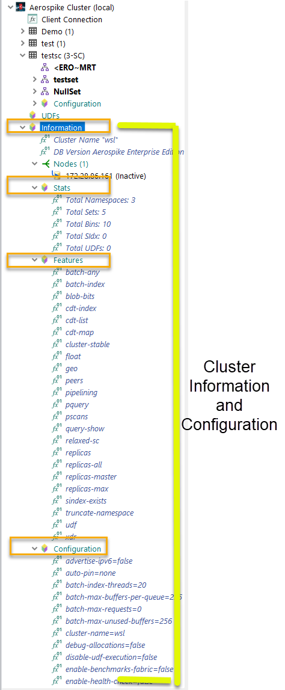
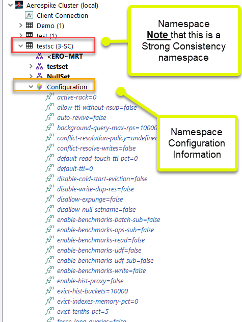

# Advanced features

## Use the native Aerospike C# client

Driver helpers and native APIs can be mixed in the same LINQPad query. Native APIs are useful for operations not wrapped by the driver, policy experiments, and code that will later move into an application.

```csharp
using Aerospike.Client;

var policy = new ScanPolicy
{
    filterExp = Exp.Build(
        Exp.RegexCompare("^J", RegexFlag.NONE, Exp.StringBin("FirstName")))
};
```

Prefer the client and connection information already exposed by the active driver context. Creating an additional `AerospikeClient` is appropriate only when the query deliberately needs an independent connection or policy lifecycle.

## Code generation

The driver can generate `Get`, `Put`, and batch code from records or result sets. Output can target:

- Driver extension APIs.
- Native Aerospike C# client APIs.

Example:

```csharp
test.Track
    .Take(3)
    .ToAPICodeBatch(useAerospikeAPI: true)
    .Dump();
```

Generated code is a starting point. Review policies, timeouts, keys, set names, bins, write semantics, and error handling before moving it into an application.

See `linqpad-samples/Demo/Generate Code.linq`.

## Cluster and namespace metadata

The connection tree exposes cluster and namespace information, including server version, nodes, features, configuration, set information, indexes, and UDFs.





Metadata is a snapshot. Refresh the connection after schema-shape changes, new indexes, UDF changes, or cluster topology changes.

## Policy overrides

Default policies come from the connection. Namespace, set, transaction, and native API operations can use cloned or explicit policies for a specific query.

Keep overrides local to the query when possible so an experiment does not silently change unrelated operations.

## Record display customization

Record, Dynamic, and Detail views control how LINQPad dumps records. A query can also change a set's record view programmatically when a different representation is useful for one result.

## Secondary-index management

Generated set objects expose index creation, query, and drop helpers. Index creation is a cluster operation; confirm namespace storage configuration, index type, bin type, and rollout impact before running it outside development.

## Null-set access

Records with no set name are available through `NullSet`. The driver preserves Aerospike metadata so the query can distinguish records and inspect their actual set information.

## Diagnostics

Driver logging and generated-class persistence can help diagnose metadata discovery and dynamic-code issues. When reporting a problem, capture:

- Driver version.
- LINQPad version and operating system.
- Aerospike client and server versions.
- Connection options relevant to discovery and conversion.
- A minimal `.linq` reproduction.
- Sanitized generated classes or driver logs when needed.

[Back to the documentation index](README.md)
