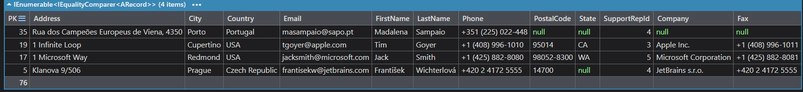
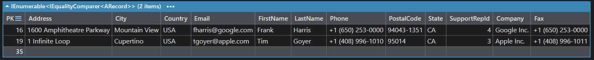
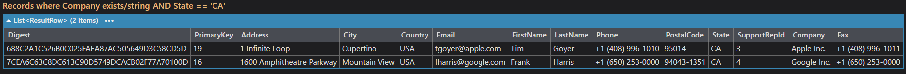
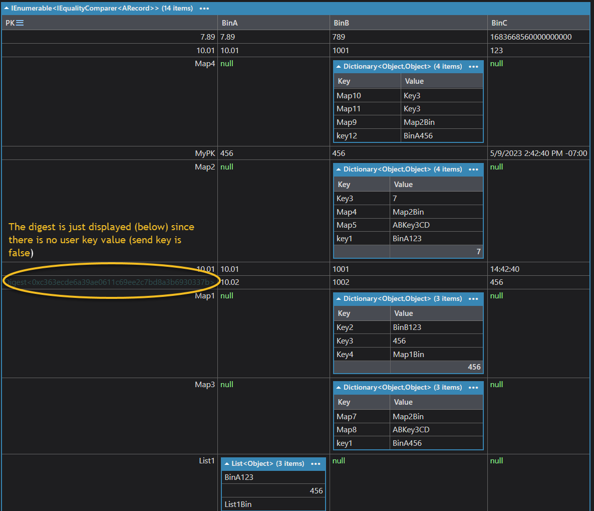
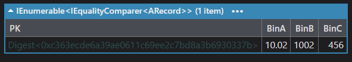

# Auto Values fundamentals

> **Auto Values guide:** [Overview](README.md) · [Fundamentals](fundamentals.md) · [Conversion and comparison](conversion-and-comparison.md) · [Collections and search](collections-and-search.md) · [Expressions and querying](expressions-and-querying.md) · [Reference and mistakes](reference.md)

## Why Auto Values Exist

Aerospike stores a limited set of native data types, including:

-   String
-   Integer / long
-   Double
-   Boolean
-   Map / dictionary
-   List
-   Bytes / blob
-   Geospatial
-   HyperLogLog

The LINQPad driver can expose those values as convenient .NET-facing values. In addition, the driver can transform or convert values into common .NET types that Aerospike does not natively store, such as:

-   `DateTime`
-   `DateTimeOffset`
-   `TimeSpan`
-   `decimal`
-   numeric variants
-   dictionaries
-   lists
-   byte arrays
-   JSON objects
-   GeoJSON objects

In most queries, you do not need to cast manually. The driver handles compatible conversions between Aerospike values and .NET types.

***


## AValue Versus Raw Bin Access

`AValue` gives the driver a consistent representation for Aerospike bins, including bins that are missing or have different types across records.

Consider a `Customer` set in the `test` namespace. Some records do not have a `Company` bin, and the `State` bin may also be missing or contain different data types. The goal is to find customers in California that have a company value.

Below is a sample of the customer set:



The following examples compare four ways to express the same request:

1.  Using Auto Values
2.  Using native .NET data types with Auto Values disabled
3.  Using Aerospike Expression Filters
4.  Using the native Aerospike C# client without driver helpers

### Example using Auto Values

```csharp
from customer in test.Customer.AsEnumerable()
where !customer.Company.IsEmpty && customer.State == "CA"
	select customer
```

The result set:



The query remains safe when `State` or `Company` is missing because `AValue` handles the missing-value checks.

If `State` contains another type, `AValue` applies its comparison rules instead of requiring an unsafe direct cast.

### Example using native .NET data types

Here Auto Values are disabled, so the query must verify that `State` is a string before comparing it.

```csharp
from customer in test.Customer.AsEnumerable()
where !String.IsNullOrEmpty(customer.Company)
		&& customer.State is string s && s == "CA"
select customer
```

The result set:


In this example we had to write more code and checks to ensure proper execution.

### Example using an Aerospike expression filter

This version moves the filtering to Aerospike by passing an expression to `Query(...)`.

```csharp
from customer in test.Customer
					.Query(Aerospike.Client.Exp.And(
							Aerospike.Client.Exp.EQ(
								Aerospike.Client.Exp.StringBin("State"),
								Aerospike.Client.Exp.Val("CA")),
							Aerospike.Client.Exp.BinExists("Company")))
select customer
```

The result set:


In this example we show how to write Aerospike Filter Expressions which results in server-side query execution.

Note: Working with complex filtering can result in difficulty writing and understanding Filter Expressions.

### Example using the native Aerospike C# client

This version uses only the native Aerospike C# client APIs.

```csharp
void Main()
{
    var host = "172.18.174.125";
    var port = 3000;

    var aerospikeNamespace = "test";
    var setName = "Customer";

    var clientPolicy = new ClientPolicy();
    using var client = new AerospikeClient(clientPolicy, host, port);

    var collector = new MatchingRecordCollector();

    var scanPolicy = new ScanPolicy();

    client.ScanAll(scanPolicy, aerospikeNamespace, setName, collector.OnRecord);

    var results = collector.Rows
        .OrderBy(r => r.Company)
        .ThenBy(r => r.State)
        .ThenBy(r => r.LastName)
        .ThenBy(r => r.FirstName)
        .ToList();

    results.Dump("Records where Company exists/string AND State == 'CA'");
}

sealed class MatchingRecordCollector
{
    private readonly ConcurrentBag<ResultRow> _rows = new();
    private long _scannedCount;

    public IReadOnlyCollection<ResultRow> Rows => _rows;
    public long ScannedCount => Interlocked.Read(ref _scannedCount);

    public void OnRecord(Key key, Record record)
    {
        Interlocked.Increment(ref _scannedCount);

        // Company must exist and be a string
        var companyValue = record.GetValue("Company");
        if (companyValue is not string company || string.IsNullOrWhiteSpace(company))
            return;

        // State must exist and normalize to "CA"
        var stateValue = record.GetValue("State");
        if (!IsCalifornia(stateValue))
            return;

        _rows.Add(new ResultRow
        {
            Digest = ToHex(key.digest),
            PrimaryKey = TryGetUserKey(key),
            Address = GetBinText(record, "Address"),
            City = GetBinText(record, "City"),
            Country = GetBinText(record, "Country"),
            Email = GetBinText(record, "Email"),
            FirstName = GetBinText(record, "FirstName"),
            LastName = GetBinText(record, "LastName"),
            Phone = GetBinText(record, "Phone"),
            PostalCode = GetBinText(record, "PostalCode"),
            State = NormalizeState(stateValue),
            SupportRepId = GetBinText(record, "SupportRepId"),
            Company = company,
            Fax = GetBinText(record, "Fax")
        });
    }

    private static bool IsCalifornia(object? value) =>
        string.Equals(NormalizeState(value), "CA", StringComparison.OrdinalIgnoreCase);

    private static string? NormalizeState(object? value) =>
        value switch
        {
            null => null,
            string s => s.Trim(),
            char c => c.ToString().Trim(),
            byte[] bytes => Encoding.UTF8.GetString(bytes).Trim(),
            _ => value.ToString()?.Trim()
        };

    private static string? GetBinText(Record record, string binName) =>
        NormalizeState(record.GetValue(binName));

    private static string? TryGetUserKey(Key key)
    {
        try
        {
            return key.userKey?.Object?.ToString();
        }
        catch
        {
            return null;
        }
    }

    private static string ToHex(byte[]? bytes) =>
        bytes is null ? "" : Convert.ToHexString(bytes);
}

sealed class ResultRow
{
    public string Digest { get; init; } = "";
    public string? PrimaryKey { get; init; }
    public string? Address { get; init; }
    public string? City { get; init; }
    public string? Country { get; init; }
    public string? Email { get; init; }
    public string? FirstName { get; init; }
    public string? LastName { get; init; }
    public string? Phone { get; init; }
    public string? PostalCode { get; init; }
    public string? State { get; init; }
    public string? SupportRepId { get; init; }
    public string Company { get; init; } = "";
    public string? Fax { get; init; }
}
```

The result set:



This example illustrates how much connection, policy, record, and conversion code the driver can remove from an interactive LINQPad query. Native client code remains appropriate when that lower-level control is required.

### Obtaining the Associated Aerospike Bin/Value Instance

The Aerospike Client API `Bin` instance can be obtained by means of the `ToBin()` method. For Aerospike server-side expression literal values, use `ToExpVal()`. For expression bin references, use `ToExpBin(...)`.

***

***


## APrimaryKey and Primary Key Values

`APrimaryKey` is the primary-key companion to `AValue`. It gives the driver a consistent way to represent Aerospike keys in LINQPad, even when primary keys are different types across records, user key values ([send key policy](https://aerospike.com/docs/database/learn/policies#send-key) is true), working with [Aerospike digests](https://aerospike.com/docs/database/learn/architecture/data-storage/data-model/#keys-and-digests), etc.

`APrimaryKey` provides the same inspection and conversion model for record keys. It also supports user-key and digest comparisons, digest creation from a user key, and key conversion between namespaces or sets.

Below is an example where a record was inserted with the “send key” policy was set to false.



I want to be able to retrieve this record by means of the user key value and the digest (you can always use the digest to obtain any record when using the driver).

```csharp
test.DataTypes.Where(r => r.PK == "NoPKValueSaved") //using the user key value
```

Below is the result set:



```csharp
test.DataTypes.Where(r => r.PK == "0xc363ecde6a39ae0611c69ee2c7bd8a3b6930337b")
```

Below is the result set:


Note that the digest can be represented as a hex string, a byte array, APrimaryKey instance, etc.

### Obtaining the Associated Aerospike Client Key Instance

The Aerospike Client API Key instance can be obtained by means of the `AerospikeKey` property.

***

***


## Basic Comparisons

`AValue` is designed to make common LINQPad comparisons feel natural.

In many cases, you can compare an `AValue` directly to a normal .NET value:

```csharp
test.DataTypes
    .Where(dt => dt.BinA == "BinA123")
    .Dump("Records where BinA equals BinA123");

test.DataTypes
    .Where(dt => dt.BinB == 1001)
    .Dump("Records where BinB equals 1001");
```

This is a core Auto Values use case: you can often compare values without manually casting them to match the underlying Aerospike DB type.

### Equality Comparisons

Use direct equality when the intent is simple value equality:

```csharp
test.DataTypes
    .Where(dt => dt.BinA == "10.01")
    .Dump("String comparison");

test.DataTypes
    .Where(dt => dt.BinB == 1001)
    .Dump("Numeric comparison");
```

AValue equality is usually the most convenient comparison style for LINQPad exploration.

### CompareTo and Ordering Operators

`AValue` supports comparison operators and `CompareTo(...)` against other `AValue` instances, Aerospike `Value`, Aerospike `Key`, and normal objects:

```csharp
test.DataTypes
    .Where(dt => dt.BinB > 100)
    .Dump("BinB greater than 100");

test.DataTypes
    .Where(dt => dt.BinB.CompareTo(100) > 0)
    .Dump("BinB CompareTo example");
```

Greater-than and less-than comparisons are safest when both sides are numeric-compatible, date/time-compatible, or otherwise known to be comparable.

When comparing values of different non-numeric types, the driver may fall back to deterministic comparison behavior rather than semantic numeric/date/string ordering. Use type checks when the ordering meaning matters.

### Null and Missing Values

Auto Values make null and missing-bin scenarios easier to handle. For mixed or sparse sets, still use type-aware guards whenever the next operation requires a specific type.

For example:

```csharp
test.DataTypes
    .Where(dt => dt.BinExists("BinB") && dt.BinB == 1001)
    .Dump("Records where BinB exists and equals 1001");
```

Use `BinExists(...)` when the query depends on a bin being present.

***


## Type Inspection

Use `AValue` type-inspection properties when the operation depends on the underlying type:

```csharp
value.IsString
value.IsNumeric
value.IsInt
value.IsFloat
value.IsBool
value.IsList
value.IsMap
value.IsDictionary
value.IsCDT
value.IsJson
value.IsGeoJson
value.IsDateTime
value.IsDateTimeOffset
value.IsTimeSpan
value.IsKeyValuePair
value.IsEmpty
value.UnderlyingType
```

Examples:

```csharp
test.DataTypes
    .Where(dt => dt.BinB.IsInt && dt.BinB < 800)
    .Dump("BinB less than 800 where BinB is an integer");

test.DataTypes
    .Where(dt => dt.Profile.IsJson)
    .Dump("Records where Profile is JSON");
```

Use the exact properties available on your driver version.

***

[Back to the Auto Values overview](README.md)
