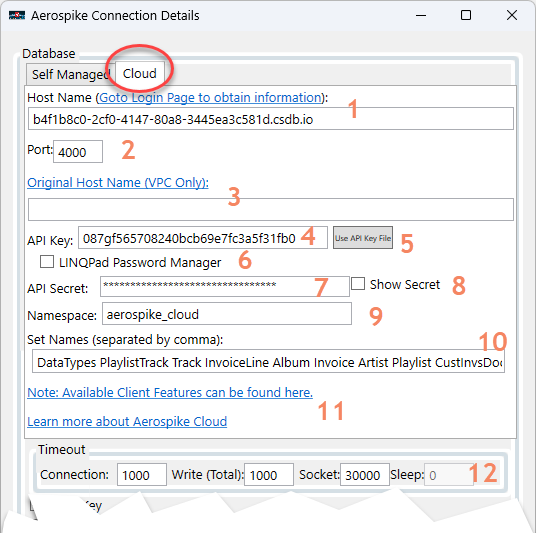
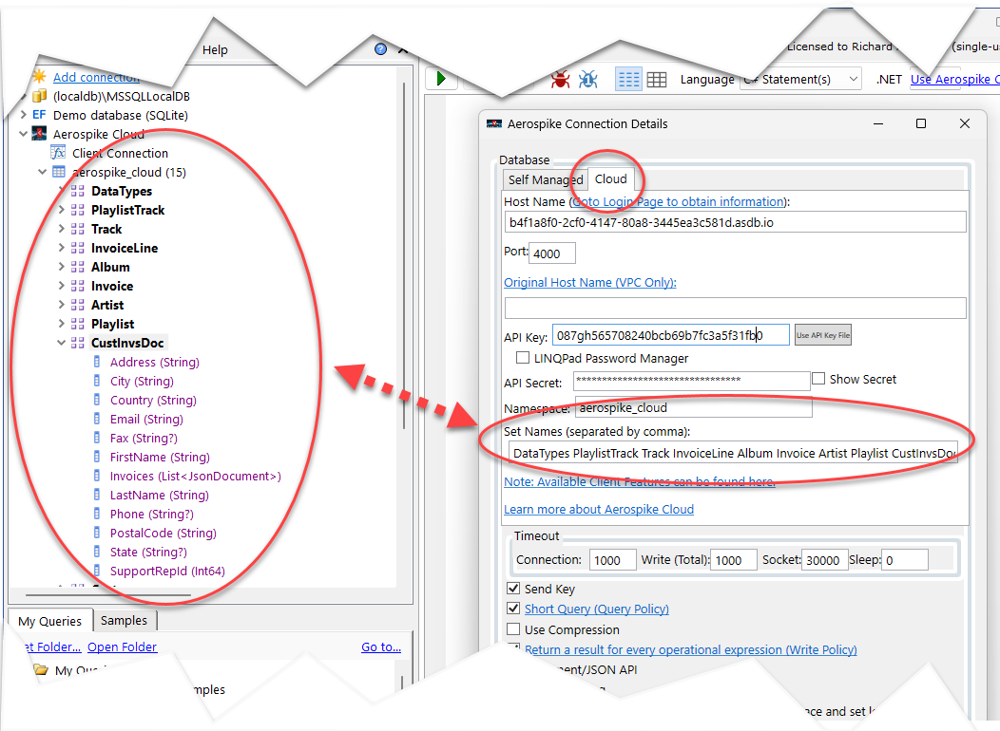
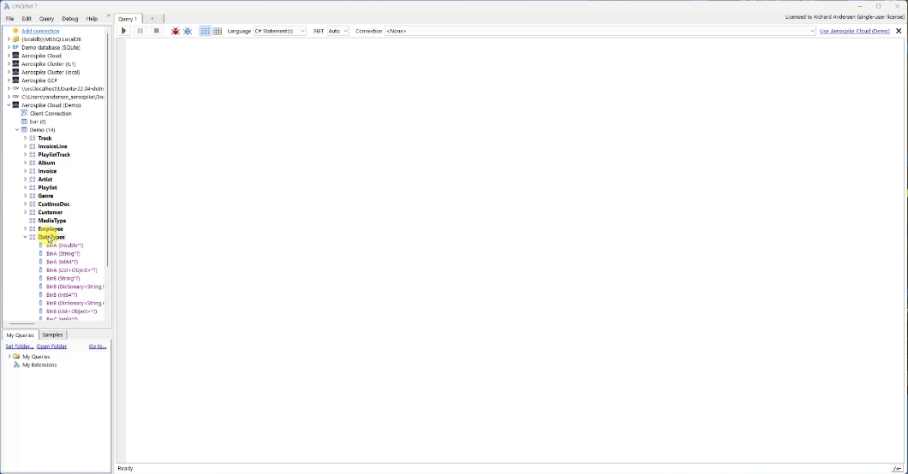
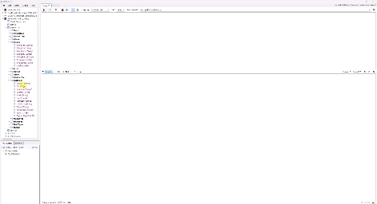
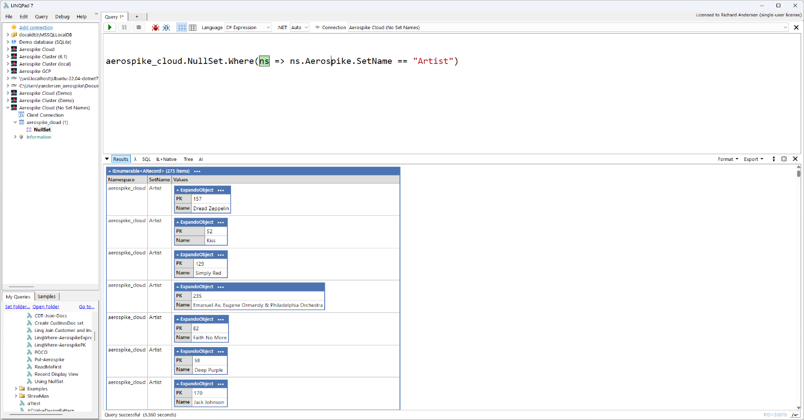

# Unlock Aerospike Cloud: Exploring the Power of Aerospike LINQPad Driver


The Aerospike LINQPad driver is now able to connect to the Aerospike Cloud providing all the power of [LINQPad](https://www.linqpad.net/nugetsamples.aspx) and the [Aerospike LINQPad driver](https://github.com/aerospike-community/aerospike-linqpad-driver/tree/main/linqpad-samples).

This includes a graphical interface, [LINQ](https://learn.microsoft.com/en-us/dotnet/csharp/linq/) support, and enhanced driver features to support Aerospike API. For an overview of the Aerospike LINQPad driver, please [review this blog post](https://aerospike.com/developer/blog/aerospike-for-linqpad).

Let’s look at the new connection dialog and some of the features of the LINQPad driver.

## Connection Dialog

The connection dialog will now have two tabs. The first tab will be for native, or “self-managed” Aerospike clusters and the second tab is used to connect to the Aerospike Cloud. Below shows the connection properties:  


A review of each property is below:

The Cloud client connection port.

1.  The hostname provided in the Cloud dashboard. The hyperlink will take you to the Aerospike Login screen or if you are already logged in to the dashboard.
2.  If a [VPC (AWS private link)](https://aerospike.com/docs/cloud/connect/private-link) is defined, this would be the hostname displayed on the dashboard. The hostname filed would be the VPC endpoint.
3.  The API key created in the dashboard.
4.  If the API key and secret was exported from the dashboard to your local machine, this button will allow you to import that API Key CSV file.
5.  If enabled, the built-in LINQPad password manager is used. When enabled, a dropdown will be displayed to select your Password Name you defined in the manager. The Password Manager can be found on the File menu of LINQPad.
6.  The associated API Key’s secret.
7.  If checked, it will show the API secret in plain text.
8.  The associated cloud namespace.
9.  If provided, a list of [set](https://aerospike.com/docs/server/architecture/data-model) names separated by comma or space. The set names will be used to populate the sets under the namespace in the LINQPad connection tree (see below image). Also, set and bin “detection” will be performed to obtain the bins and data types. Regardless if this field is provided or not, you can always obtain this information from the “[Null Set](https://aerospike.com/docs/server/architecture/data-model)”. See “[Using Null Set](#_Using_the_Aerospike)” section below.
10. Hyperlinks to additional topics
11. The timeout values that will be used when obtaining the connection or performing an operation. Note that the “Sleep” field is ignored for cloud connections.

Below shows the relationship between the “set names” connection property and the LINQPad connection tree:



## Driver Overview

Al the features of the Aerospike LINQPad driver are available including the following:

-   Graphical Interface with all LINQPad features.
-   Drag-and-Drop of set names.
-   LINQ
-   Serialize and deserialize any C\# object via the Object-Mapper (POCO)
-   Auto-Values which provides dynamic data type conversion from Aerospike types to .Net types without testing or casting.
-   JSON support
-   Explore the Aerospike API directly or use the driver’s enhanced API.





## Using the Aerospike Null Set

If the connection property “set names” is not provided, the set and bin names will not be provided in the LINQPad connection tree.

As such, you still can perform queries and API calls using the driver’s API features. Below is an example of a driver API call to obtain the records for Aerospike set “Artist”:

```
aerospike_cloud.NullSet.Where(ns => ns.Aerospike.SetName == "Artist")
```

Below is the output:



You can always extend the “where” clause or interact with the result set.

## Samples

You can find samples for Aerospike LINQPad Cloud under the [samples folder](https://github.com/aerospike-community/aerospike-linqpad-driver/tree/main/linqpad-samples/Cloud) or under the “Samples” tab in LINQPad.

## More Information

-   [Aerospike Cloud](https://aerospike.com/products/aerospike-cloud/)
-   [Aerospike LINQPad Driver Readme](https://github.com/aerospike-community/aerospike-linqpad-driver/tree/main/linqpad-samples)
-   [Aerospike LINQPad Blog](https://aerospike.com/developer/blog/aerospike-for-linqpad)
-   [LINQPad](https://www.linqpad.net/nugetsamples.aspx)
