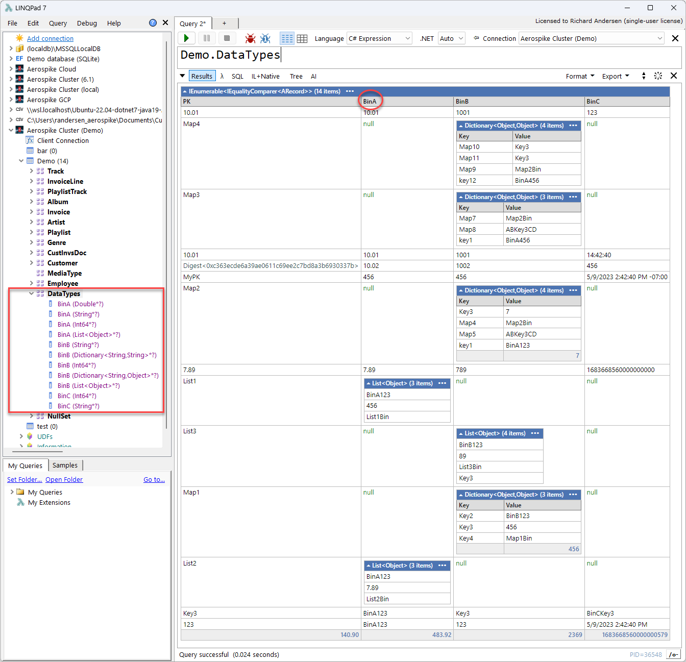
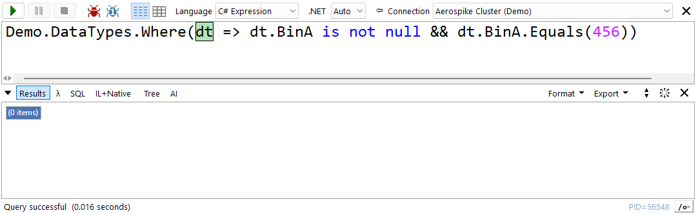
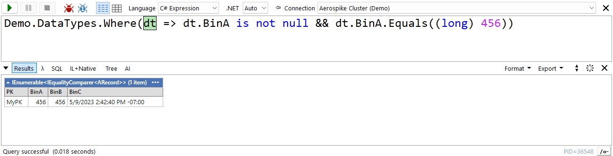
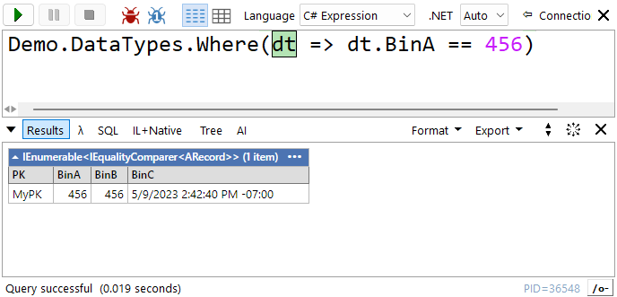
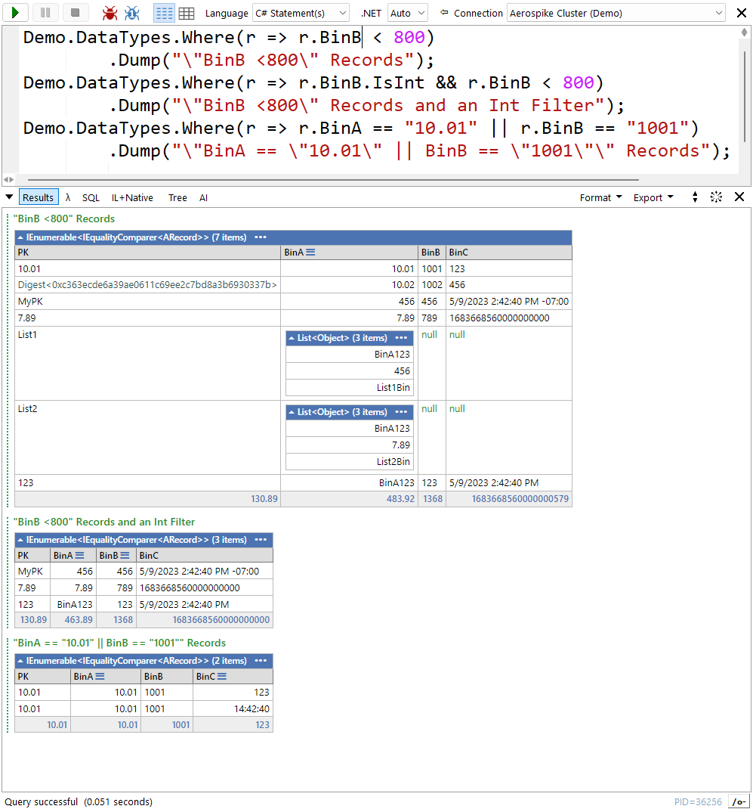
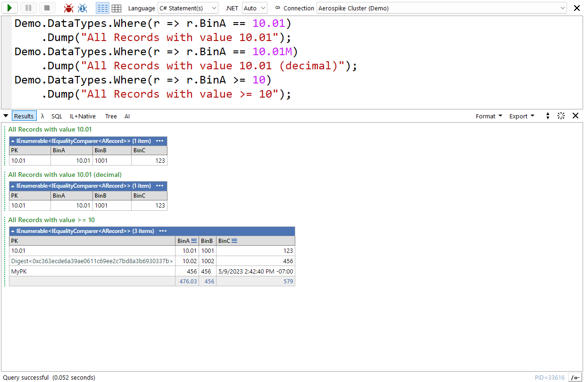
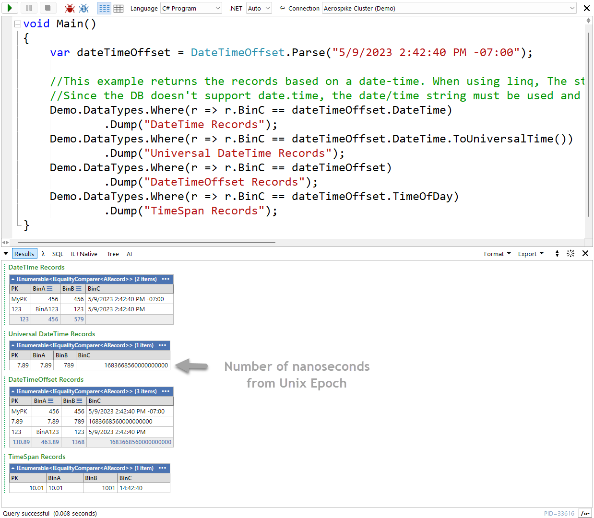
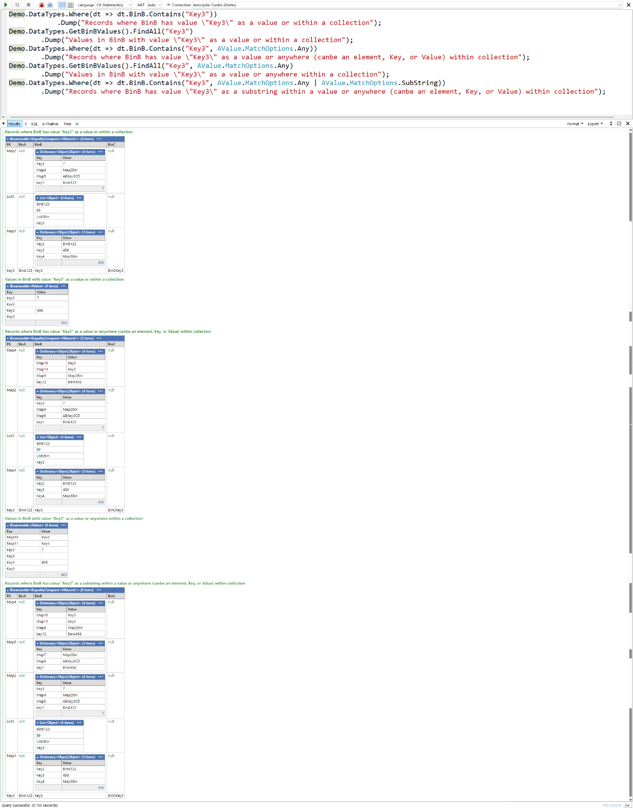
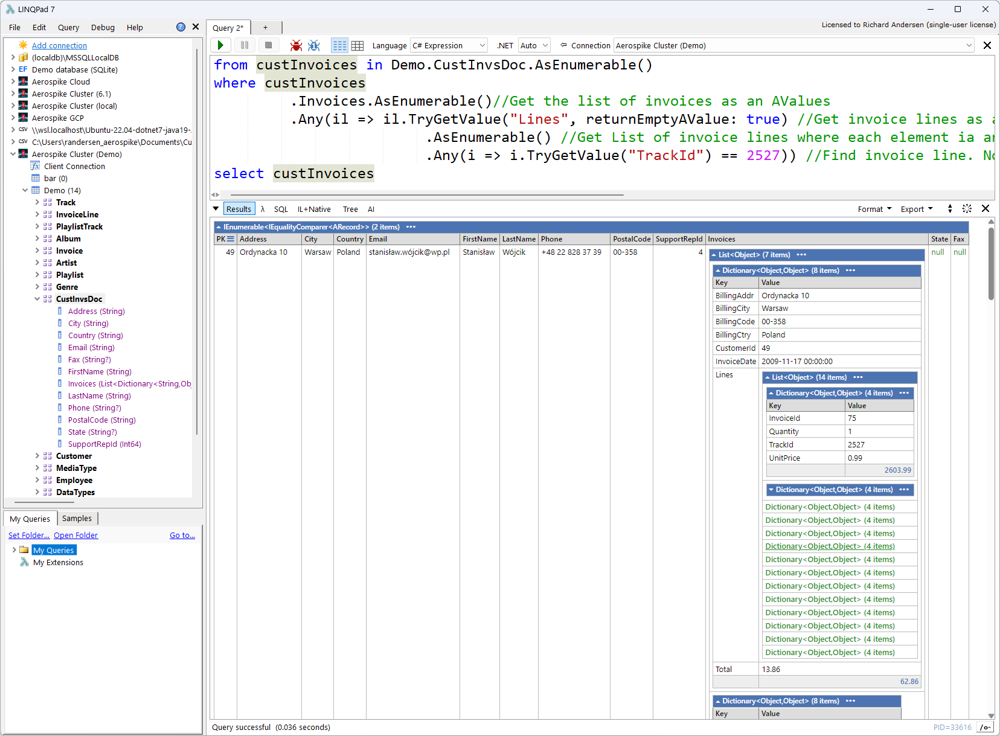
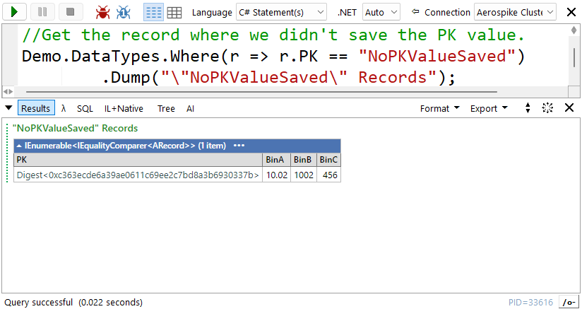

# Simplicity: Using Auto-Values in Aerospike LINQPad Driver

When working with NoSQL databases like Aerospike where a record has unstructured data. Strongly typed languages like C\# add programming complexity by having to check the existences of “bin(s)” (i.e., columns) within a record and the fact that different records for the same bin can have different data type.

Auto-Values (AValue is the class) simplify the need to check, cast, or convert values between Aerospike data types and .Net datatypes. They provide a rich set of operations and seamlessly work with any type of data including collections and JSON. They provide protection against null reference exceptions, invalid cast exceptions, etc.

## Example Set

Below shows an Aerospike set where different records have varied number of bins and bins in the record set can have varying data types (e.g., bin “BinA” can be a double, long, string, or list in different records).

As a side note, the LINQPad connection tree (left side) is expanded showing the bins for set “DemoTypes”. Each bin name is below the set name and shows the associated datatype. Note the symbols after the data type. A “**\***” indicates that the driver detected this bin has different data types in the record set. A “**?**” indicates that the driver detected that this bin wasn’t present in some of the records within this set. These symbols provided a quick view of the set and expected values. Note in the “Results” pane (bottom-right), bins with “null” are not present in that record.

## Simpe Cast Examples

Below are examples showing the difference between using Aerospike data types, C\# data types, and Auto-Values.

Below is an example when **not** using Auto-Values:

Notice that there are no results from the query even though it should have matched one record. The reason it failed is because “456” is an Int32 and the DB numeric values are Int64. So, either the bin’s value or the “456” needs to be cast. Also, we need to check to make sure the bin is present in the record otherwise a null exception is thrown. Below is an example testing and casting the value:

Let’s look at the same query using Auto-Values:

In the above example, we don’t have to check to see if the bin exists nor cast “456” to long.

Auto-Values not only take care of casting but also converting. Conversion between any of the .Net primitive type to or from any of the Aerospike data types are seamless. It also handles nullable values, JSON, and collection data types (CDT).

Auto-Values support all standard operations like “==”, “\>”, “\<”, etc. They also support all the equality, comparison, etc. operations.

Below are some additional examples:

## 

## Handling Not Supported Data Types

Aerospike supports a limited set of data types. They are:

-   String
-   Int (Int64)
-   Double
-   Bolean
-   Blob/Bytes (byte[])
-   List
-   Map (Directory)
-   Geospatial ([GeoJSON.NET](https://github.com/GeoJSON-Net/GeoJSON.Net))

The driver has extended support by allow the following .Net data types:

-   DateTime, DateTimeOffset, TimeSpan – these values are mapped to either an Aerospike string or Int data types. Auto-Values will automatically take care of the conversion.
-   [JSON](https://www.newtonsoft.com/json) – these values are mapped to an Aerospike map data type where the key is a string, and the value is variant. The driver supports nested JSON objects without any depth restrictions.

Below are examples where a .Net DateTimeOffset, DateTime, and TimeSpan instance is used to obtain matching records. The values in the Aerospike DB are strings or an Int64 value (number of nanoseconds from Unix Epoch). The driver will manage the conversion between these different types.

BTW, you can control how values are converted and display based on the properties found in the “Display/Conversion Options” section of the connection dialog.

## Conversion

Auto-Values provide a rich set of conversion functions. Some of them are:

-   Convert\<T\> -- Will try to convert to the provided .Net data type. If it cannot, an invalid cast exception is thrown.
-   Is{data type} – Use to test if the underlying .Net data type is that {date type}. Examples of these functions are: IsList, IsCDT, IsJSON, IsInt16, IsNumeric, IsString, etc.
-   To{data type} – Will try to convert to the .Net {data type}, if possible. Note {data type} can be Dictionary, List, .Net native type, etc. Examples of these functions are: ToList, ToBoolean, ToByte, etc.
-   TryGetValue\<T\> – This will try to match a provided value and convert the value into the provided .Net data type. If not successful, the default value of that data type and/or false is returned, depending on usage. This function can be applied against CDTs or non-CDT values.
-   TryGetValue – This will try to match the provided value. If successful, the matched value is returned as an Auto-Value. If not, an empty Auto-Value, false, or null can be returned depending on usage. This function can be applied against CDTs or non-CDT values.
-   AsEnumerable – This will convert an Auto-Value into an enumerable object if it is a DB CDT. If not a CDT, an empty enumeration is returned. All elements in the CDT are scanned and converted into Auto-Values. This will provide the highest level of protection again invalid casts or null value reference exceptions. This also allow for the use of the advance Auto-Value functions outlined in the [Collection Data Types](#collection-data-types) section.
-   Implicit Casting – Auto-Values know how to implicitly cast from an Aerospike data type to any .Net primary type without explicitly providing the type.

Detailed documentation can be found by means of IntelliSense or reviewing the functions individual documentation.

## Collection Data Types

Auto-Values can seamlessly be used to find elements within CDTs. The supported operations are:

-   Contains – returns true if the matching value is contained in a bin’s value or an element within a CDT. The matching options determine how the matches occur.
-   FindAll – returns a collection of matching Auto-Values. A match can occur as a bin’s value or an element within a CDT. The matching options determine how the matches occur. If no matches are found, an empty enumerable is returned.
-   TryGetValue – returns the first matching value (as an Auto-Value) contained in a bin’s value or an element within a CDT. If the Auto-Value is not found an Empty Auto-Value is returned.
-   OfType\<T\> -- Tries to cast the Auto-Value to the provided .Net type creating a new collection of those types. If a value cannot be cast, it will be ignored.
-   Cast\<T\> -- Will cast the Auto-Value to the provided .Net type. If it cannot be cast, an invalid cast exception will occur.
-   Convert\<T\> -- Will try to convert the Auto-Value resulting in a collection of converted .Net values. If an Auto-Value cannot be converted, it will be ignored.

Below are some examples using “Contains” and “FindAll” methods:

You can find additional examples in the [LINQPad sample folder](https://github.com/aerospike-community/aerospike-linqpad-driver/tree/main/linqpad-samples/Cloud).

Below is an example of “drilling” into several different sub-collections finding all invoices for a certain song track resulting in a collection of customers. You can find this example in the “[CDT-Json-Docs](https://github.com/aerospike-community/aerospike-linqpad-driver/blob/main/linqpad-samples/Native/CDT-Json-Docs.linq)” sample LINQPad script.

## Primary Key

Auto-Values are extended to the Primary Key’s value. They have the same features as the Bin’s Auto-Values. There are a few additional features but the primary one is using digest values.

If the primary key value is not saved (only the digest is used), matching to a value can still occur.

Below is an example where the digest is only available in the DB, but a value can still be used to find the record.

## Samples

You can find samples for Aerospike LINQPad under the [samples folder](https://github.com/aerospike-community/aerospike-linqpad-driver/tree/main/linqpad-samples/Cloud) or under the “Samples” tab in LINQPad.

## More Information

-   [Aerospike LINQPad Driver Readme](https://github.com/aerospike-community/aerospike-linqpad-driver/tree/main/linqpad-samples)
-   [Aerospike LINQPad Blog](https://aerospike.com/developer/blog/aerospike-for-linqpad)
-   [LINQPad](https://www.linqpad.net/nugetsamples.aspx)
