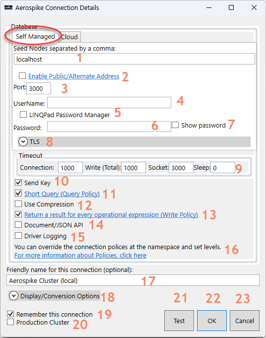
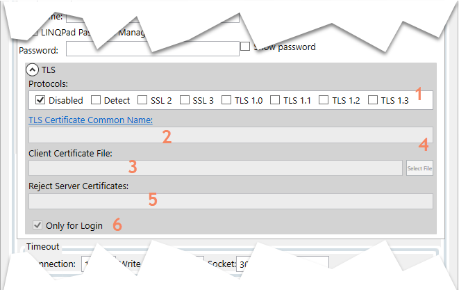
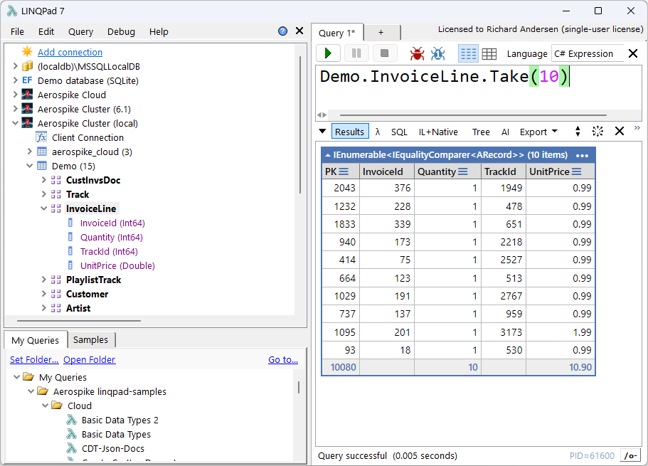
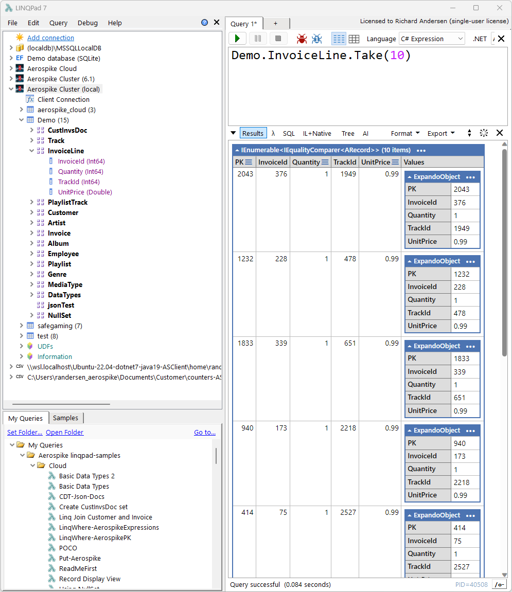
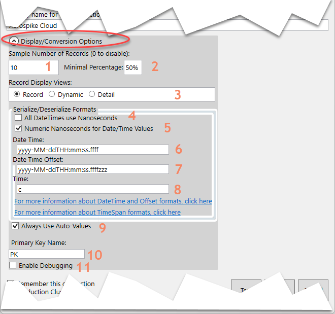

# Connection configuration

The connection dialog controls how the driver reaches Aerospike, discovers data shape, converts values, displays records, and guards production clusters.

## Database connection

| Setting | Purpose |
|---|---|
| Seed nodes | One or more comma-separated hosts used to discover the cluster |
| Port | Aerospike service port, commonly `3000` |
| Public/alternate address | Uses alternate service addresses advertised by the cluster; typically needed only across NAT or public networking |
| Username and password | Aerospike security credentials |
| LINQPad Password Manager | Stores and resolves the password by a LINQPad-managed name |
| Friendly name | Label shown in the LINQPad connection tree |

Use **Test** before saving. A successful test validates basic connectivity and, when TLS is enabled, performs certificate validation.

## TLS

The TLS panel supports:

- One or more TLS protocol versions.
- The Aerospike host TLS name / certificate common name.
- A client certificate file.
- A comma-separated list of server-certificate serial numbers to reject.
- TLS used only for login authentication.

When the certificate common name is blank, a connection test can discover and populate it from the certificate. Verify the discovered value before saving the connection.

## Timeouts and client policies

The connection defines defaults used by driver operations. Namespace and set access objects can clone or override policies for a specific query or operation.

| Setting | Purpose |
|---|---|
| Socket timeout | Maximum socket inactivity period for an operation |
| Connection timeout | Time allowed to establish a node connection |
| Total timeout | Overall operation limit for reads, writes, deletes, and queries |
| Retries | Maximum retry count |
| Sleep between retries | Delay between retry attempts; `0` disables the delay |
| Connections per node | Physical connection-pool size; `-1` lets the driver choose from client CPU information |
| Send Key | Stores and returns the user key in addition to the digest when supported by the operation |
| Expected Duration | Query-policy hint describing the expected query duration/result behavior |
| Compression | Enables network compression where supported |
| Return every operation result | Sets write-policy `respondAllOps`, which is useful when inspecting multi-operation results |

Choose these values based on the operation and environment. A short primary-key read and a large scan should not necessarily share the same total timeout or retry behavior.

`Send Key` affects whether a queried record can return the original user-key value. When it is disabled for a write, the record can still be addressed by digest, but the original key value is not stored with the record.

## Metadata discovery

Aerospike is schemaless. To provide generated properties and IntelliSense, the driver samples records from each set and infers commonly observed bins and types.

| Setting | Effect |
|---|---|
| Sample number of records | Maximum records examined per set; `0` disables set/bin type discovery |
| Minimum percentage | Required occurrence rate for a sampled bin/type to be treated as representative |
| Force/refresh metadata | Rebuilds metadata when the underlying set shape has changed |

Sampling is descriptive, not a schema guarantee. Unsampled records can contain missing, additional, or differently typed bins.

## Record display views

| View | Behavior |
|---|---|
| Record | Grid-like output using discovered bin properties |
| Dynamic | Flexible output when discovery is disabled, incomplete, or a record has additional bins |
| Detail | Expanded view including normally hidden record properties |

## Serialization and conversion

The driver can represent `DateTime`, `DateTimeOffset`, and `TimeSpan` values as formatted strings or numeric values. Connection options control:

- Whether date/time values use nanoseconds from the Unix epoch.
- Whether numeric date/time values are interpreted as Unix-epoch nanoseconds or .NET ticks.
- String formats for `DateTime`, `DateTimeOffset`, and `TimeSpan`.
- Whether generated bin properties always use `AValue`.
- The generated primary-key property name.

Changing conversion settings changes how values are interpreted and written. Confirm the storage convention used by the application that owns the data before writing converted date/time values.

## Document/JSON API

Enable **Document/JSON API** when queries need the driver's JSON and document helpers. This uses Json.NET and the driver's document mapping support. See [Data mapping and documents](data-mapping-and-documents.md).

## Production cluster safeguard

Enable **Production Cluster** for a production connection. The driver rejects selected high-risk operations, including truncate and import, instead of allowing them to run accidentally.

This setting is a guardrail, not a complete authorization boundary. Use Aerospike roles, credentials, network controls, and code review as the primary controls.

## Debugging and logging

- **Driver Logging** enables driver diagnostic output.
- **Enable Debugging** can persist dynamically generated C# classes into the LINQPad query folder for troubleshooting.

Debug output may contain connection metadata or data-shape information. Do not share it without reviewing its contents.

[Back to the documentation index](README.md)
