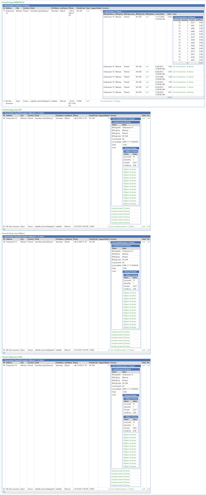

# Data mapping and documents

The driver can map Aerospike records to C# objects, write C# objects back as records, and work with JSON or nested document structures.

## Record-to-object mapping

Bins map to public properties or fields. The driver selects a suitable constructor and then sets remaining writable members.

Useful Aerospike client attributes include:

| Attribute | Purpose |
|---|---|
| `Aerospike.Client.Constructor` | Marks the constructor the mapper should use |
| `Aerospike.Client.PrimaryKey` | Maps a member to the record primary key |
| `Aerospike.Client.BinIgnore` | Excludes a member from bin serialization |
| `Aerospike.Client.BinName("name")` | Uses a bin name different from the member name |

Example:

```csharp
public sealed class Customer
{
    [Aerospike.Client.Constructor]
    public Customer(long id, string firstName, string lastName)
    {
        Id = id;
        FirstName = firstName;
        LastName = lastName;
    }

    [Aerospike.Client.PrimaryKey]
    [Aerospike.Client.BinIgnore]
    public long Id { get; }

    public string FirstName { get; }
    public string LastName { get; }

    [Aerospike.Client.BinName("BillingAddr")]
    public string BillingAddress { get; init; }
}
```

Read an object from a generated record:

```csharp
var customers = test.Customer
    .AsEnumerable()
    .Select(record => record.Cast<Customer>(record.PK))
    .Take(100)
    .ToArray();
```

Write an object:

```csharp
test.Customer.WriteObject(customer.Id, customer);
```

Review the exact overloads with LINQPad IntelliSense or the hosted API reference.

## Type conversion

Aerospike stores a smaller set of native types than .NET. The driver can convert unsupported CLR types, including date/time types, according to the active connection settings.

- Public collections map to Aerospike list or map CDTs.
- Nested classes map to document/map structures.
- Date/time values can be stored as formatted strings or numeric values.
- Numeric values can be converted to compatible CLR numeric types during mapping.

Changing connection conversion settings can change round-trip behavior. Keep the convention consistent with the application that owns the records.

## Extra and missing bins

A record can contain bins that are not represented by a C# class, and a class can define members whose bins are absent. Design mapped types so optional data is genuinely optional, and inspect extra-bin behavior before using a mapped class for rewriting records.

## JSON support

The driver includes Json.NET support. Records and collections can be converted to and from `JObject`, `JArray`, JSON strings, maps, and lists. Enable **Document/JSON API** in the connection when the document helpers are needed.

Common workflows include:

- Dump a record as JSON for inspection.
- Import JSON into a set.
- Export a set or filtered result to JSON.
- Traverse nested documents through AValue/CDT helpers.
- Use Aerospike document operations and expressions on nested paths.

## Document API

The document API treats nested maps and lists as a document structure while still using Aerospike CDTs. Use it when updates or expression filters target a nested path rather than replacing the complete document.



The `CDT-Json-Docs.linq` sample demonstrates JSON, documents, lists, maps, and expression-based access. The `POCO.linq` and `POCO-Classes.linq` samples demonstrate object mapping.

## Recommended practices

- Keep serialized member names stable once records are in use.
- Explicitly annotate primary-key and ignored members.
- Treat conversion settings as part of the data contract.
- Prefer targeted CDT/document operations for large nested documents.
- Test round trips with representative records, including sparse and mixed-type records.
- Review the generated bins before rewriting objects into an existing set.

[Back to the documentation index](README.md)
