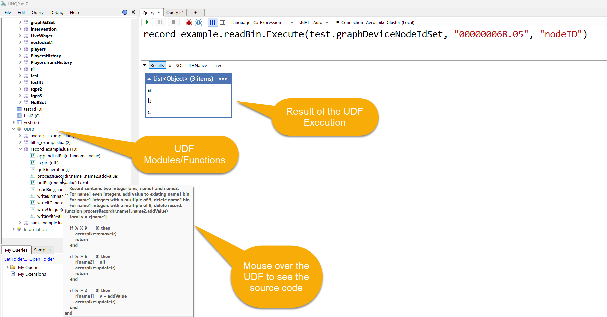

# Data operations

The driver offers convenience methods for common Aerospike operations while keeping the native C# client available for advanced cases.

> Writes, deletes, imports, truncates, and transaction commits change data. Use a development namespace first and enable the **Production Cluster** guardrail for production connections.

## Read and write a record

```csharp
var customer = test.Customer.Get(123);
customer.Dump();
```

```csharp
test.Customer.Put(
    123,
    "FirstName", "Ada",
    "LastName", "Lovelace");
```

The driver provides multiple `Put` overloads for bins, dictionaries, tuples, records, and mapped objects. Use LINQPad IntelliSense to choose the overload that matches the data shape.

## Delete and truncate

```csharp
var deleted = test.Customer.Delete(123);
deleted.Dump("Deleted");
```

```csharp
test.Customer.Truncate();
```

`Truncate` removes records from a set and is intentionally blocked when the connection is marked as production.

## Operate and CDT operations

Use `Operate(...)` for atomic combinations of reads, writes, counters, list operations, map operations, and other Aerospike operations.

```csharp
var result = test.Account.Operate(
    accountId,
    Aerospike.Client.Operation.Add(new Aerospike.Client.Bin("balance", 5)),
    Aerospike.Client.Operation.Get("balance"));

result.Dump();
```

## Batch operations

The driver supports batch reads, writes, and deletes. Batch operations reduce round trips and should be preferred over a tight loop of independent requests when the operation fits an Aerospike batch API.

Examples are available through the generated set methods and `Generate Code.linq`.

## Import and export

A set can export matching records to JSON and import records from JSON. An expression can restrict exported records.

```csharp
var exported = test.Customer.Export(
    @"C:\temp\customers.json",
    filterExpression: null,
    indented: true);

exported.Dump("Records exported");
```

Import/export formats can contain metadata used to preserve keys, set names, bins, generations, and expiration data. Review the output file before using it as a migration format.

Production connections block import operations as a safety measure.

## User-defined functions

UDFs discovered from the cluster appear in the connection tree. The driver exposes them like callable methods and supplies argument information for IntelliSense.



Use UDFs only where they are appropriate for the Aerospike deployment and workload. Prefer current Aerospike-supported server-side capabilities when they provide a clearer or more efficient solution.

## Multi-record transactions

The driver supports Aerospike multi-record transactions (MRT) through `ATransaction` and the native client API.

```csharp
var transaction = test.CreateTransaction();

try
{
    // Use transaction-scoped namespace or set operations here.
    var result = transaction.Commit();
    result.Dump("Commit result");
}
catch
{
    transaction.Abort().Dump("Abort result");
    throw;
}
```

Key operations:

- `CreateTransaction(...)` begins an MRT and returns an `ATransaction`.
- `Commit()` commits and handles in-doubt retry logic exposed by the driver.
- `Abort()` rolls back the transaction.
- `RecordState(...)` inspects the state of a record in the transaction.

See `linqpad-samples/Demo/MRT.linq` for a complete sample.

## Native client access

The active connection exposes the underlying Aerospike client and policies. Use native APIs when a driver helper does not expose the required capability, but avoid creating an unnecessary second client when the active connection can be reused.

## Safety checklist

Before running a mutating script:

1. Confirm the connection and namespace in the LINQPad toolbar.
2. Preview keys and records with a bounded read.
3. Verify expression and index filters independently.
4. Log or dump the intended record count.
5. Use the production guardrail where applicable.
6. Review generated code before execution.
7. For MRT, handle both commit and abort paths.

[Back to the documentation index](README.md)
