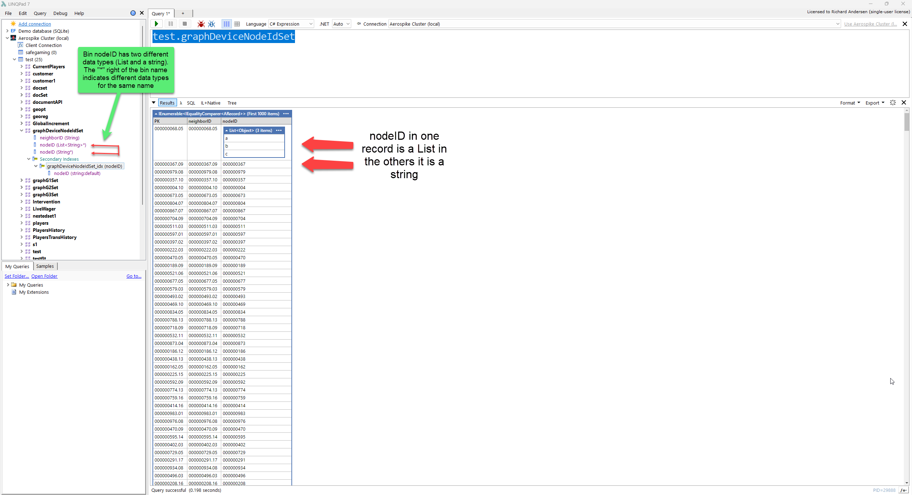

# Querying and records

The driver exposes Aerospike namespaces and sets as C# objects. A generated set implements driver operations and can also be materialized for LINQ-to-Objects queries.

## Generated properties and schemaless records

Record sampling produces generated properties for commonly observed bins. That gives IntelliSense such as:

```csharp
test.Customer.First().FirstName
```

Aerospike remains schemaless. A generated property can still represent a missing value, and records can contain bins not present in the generated class. With Auto Values enabled, use `IsEmpty`, conversion helpers, and type-aware operations rather than assuming a fixed type.



## Choose the execution model

### Bounded set read

```csharp
test.Customer.Take(100).Dump();
```

Use a bounded read to inspect a set. Avoid dumping an unbounded large set.

### Client-side LINQ

```csharp
var rows =
    from customer in test.Customer.AsEnumerable()
    where customer.State == "CA"
    orderby customer.LastName
    select customer;

rows.Take(100).Dump();
```

`AsEnumerable()` materializes records and enables normal LINQ operators. Filtering, sorting, grouping, and joining then run in the LINQPad process.

This is useful for exploration and cross-set joins, but it can transfer more data than a server-side query.

### Server-side Aerospike expression

```csharp
var expression = Aerospike.Client.Exp.And(
    Aerospike.Client.Exp.EQ(
        Aerospike.Client.Exp.StringBin("State"),
        Aerospike.Client.Exp.Val("CA")),
    Aerospike.Client.Exp.BinExists("Company"));

test.Customer.Query(expression).Take(100).Dump();
```

Expression code uses raw Aerospike bin names and Aerospike expression types. The expression is evaluated on the server before matching records are returned.

### Primary-key read

```csharp
var customer = test.Customer.Get(123);
customer.Dump();
```

A direct primary-key read is usually preferable when the key is known.

### Secondary-index query

Secondary indexes appear below the set in the connection tree. Use the generated index object or construct an Aerospike `Filter`, depending on the query. Index queries can also include an expression for additional server-side filtering.

## Auto Values in predicates

For sparse or mixed-type properties, prefer AValue-aware operations:

```csharp
var rows =
    from customer in test.Customer.AsEnumerable()
    where customer.FirstName.TryApply<string, bool>(
        name => name.StartsWith("J", StringComparison.OrdinalIgnoreCase))
    select customer;
```

```csharp
var rows =
    from invoice in test.Invoice.AsEnumerable()
    where invoice.Total.CanConvert<decimal>()
       && invoice.Total.Convert<decimal>() > 25m
    select invoice;
```

Read the [Auto Values guide](auto-values/README.md) for conversion, map/list traversal, and comparison behavior.

## Primary keys and digests

Generated records expose a primary-key property, normally `PK`. It is an `APrimaryKey`, which can represent either the stored user key or a digest-backed key.

```csharp
from customer in test.Customer.AsEnumerable()
select new
{
    customer.PK,
    customer.FirstName,
    customer.LastName
}
```

A record written with `sendKey = false` does not store the original user-key value in the record. The digest remains available and can be used for record identity and subsequent operations.

## Joins

Aerospike does not execute relational joins across sets. LINQ joins in this driver are client-side operations after each source has been materialized.

```csharp
var rows =
    from customer in test.Customer.AsEnumerable()
    join invoice in test.Invoice.AsEnumerable()
        on customer.PK equals invoice.CustomerId
    select new
    {
        customer.FirstName,
        customer.LastName,
        invoice.InvoiceDate,
        invoice.Total
    };

rows.Take(100).Dump();
```

For large data sets, first reduce each source with primary-key reads, secondary-index queries, server-side expressions, or a purpose-built data model.

## The null set

Aerospike records can exist without a set name. The driver exposes these records through `NullSet`. Filter on the actual set metadata when needed:

```csharp
test.NullSet
    .Where(record => record.Aerospike.SetName == "Artist")
    .Take(100)
    .Dump();
```

## Common mistakes

- Calling broad LINQ operations on a large set before applying a server-side restriction.
- Treating sampled properties as a guaranteed schema.
- Using a generated property name inside `Exp.*Bin(...)` instead of the raw Aerospike bin name.
- Casting `AValue.Value` directly without checking missing, null, or mixed types.
- Assuming `PK` always contains the original user key.
- Joining entire large sets in memory without first reducing both sources.

[Back to the documentation index](README.md)
